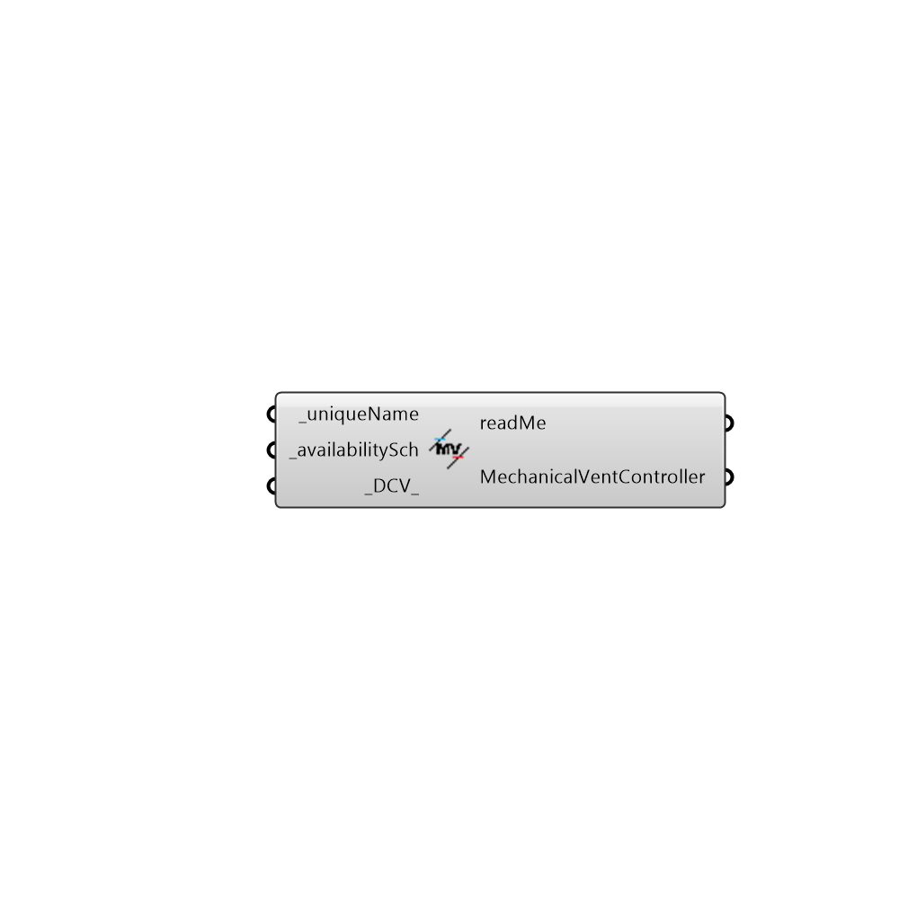

##  OpenStudio Mechanical Controller

Mechanical Ventilation Controller
 This is an optional field that overrides the economizer behavior
 It adds DCV if you want it as well.
 It can also be tricked into providing a mini purge cycle too if you want it.
 -
 

#### Inputs
* ##### uniqueName [Required]
a required field to uniquely name the economizer
* ##### availabilitySch [Required]
provide the name (string) of a Honeybee schedule that is valid.  Supply nothing, and outside air will be delivered always, which is probably not what you want.
* ##### DCV [Default]
provide a toggle here.  1 means you want DCV, 0 means you don't.  The default is zero.

#### Outputs
* ##### readMe
The execution information, as output and error streams
* ##### MechanicalVentController
...returns a controller that can be added to the Airside Economizer Definition

[Check Hydra Example Files for OpenStudio Mechanical Controller](https://hydrashare.github.io/hydra/index.html?keywords=Honeybee_OpenStudio Mechanical Controller)