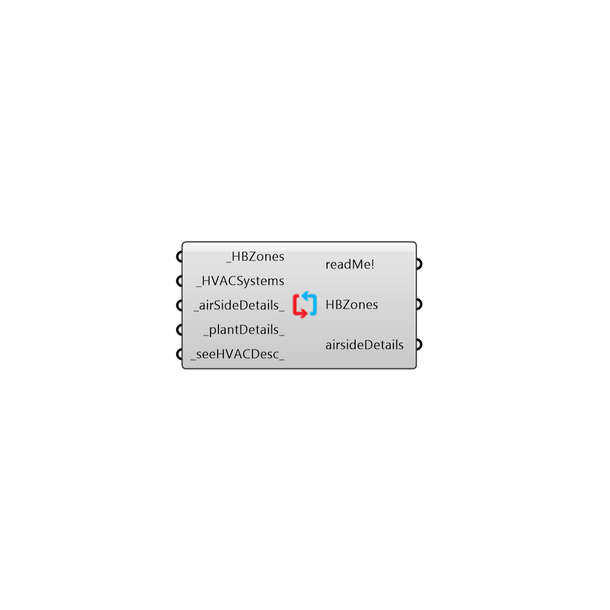

##  OpenStudio Systems

OpenStudio Systems
 -
 

#### Inputs
* ##### HBZones [Required]
...
* ##### HVACSystems [Required]
...
* ##### airSideDetails [Default]
Use Honeybee_OpenStudio detail component to define the details
* ##### plantDetails [Default]
plug in plant side details component here to include them in results
* ##### seeHVACDesc [Default]
Set to True to see the HVAC system description

#### Outputs
* ##### readMe!
Script variable OSHVACSystems
* ##### HBZones
...
* ##### airsideDetails
Script variable OSHVACSystems

[Check Hydra Example Files for OpenStudio Systems](https://hydrashare.github.io/hydra/index.html?keywords=Honeybee_OpenStudio Systems)