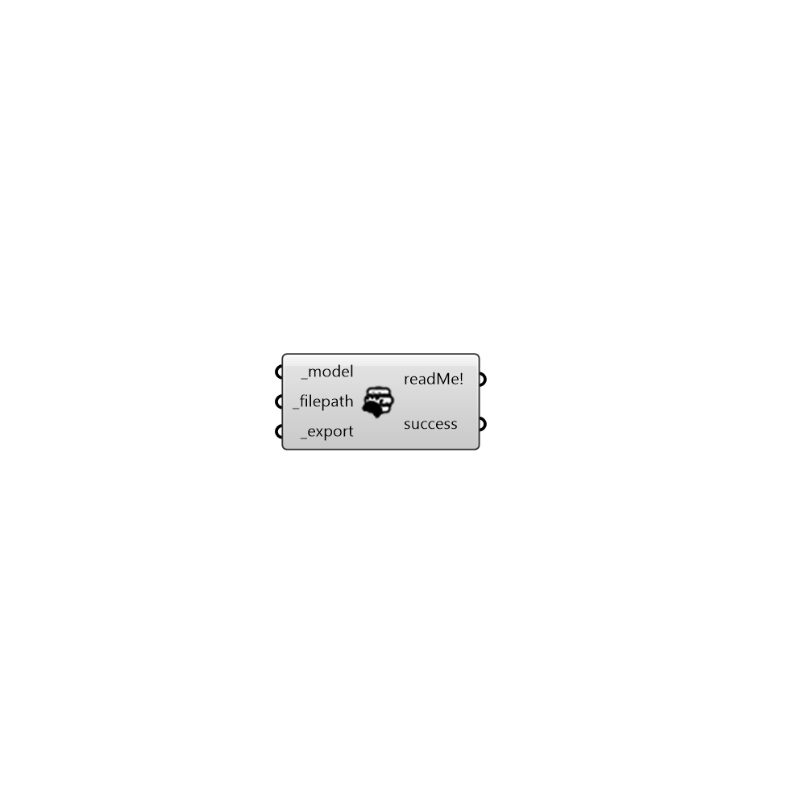

##  OpenStudio to gbXML - [[source code]](https://github.com/mostaphaRoudsari/honeybee/tree/master/src/Honeybee_OpenStudio%20to%20gbXML.py)

Use this component to export OpenStudio model to gbXML file.
 -
 

#### Inputs
* ##### model [Required]
An OpenStudio model.
* ##### filepath [Required]
Full filepath to xml file.
* ##### export [Required]
Set to True to export the model.

#### Outputs
* ##### readMe!

* ##### success
True on success.

[Check Hydra Example Files for OpenStudio to gbXML](https://hydrashare.github.io/hydra/index.html?keywords=Honeybee_OpenStudio to gbXML)