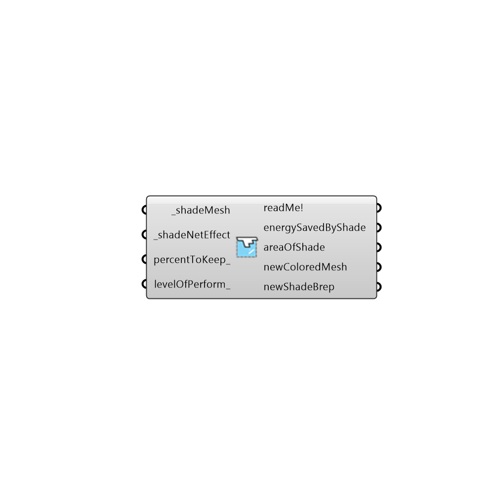

##  Optimal Shade Creator

Use this component to delete out unwanted areas of a shade after a shade benefit evaluation has been run.  This will help turn your shade evaluation results into an actual shade brep based on a percentage of beneficial shade cells that you decide.
 -
 

#### Inputs
* ##### shadeMesh [Required]
The shade mesh out of either of the shade benefit evaluators.
* ##### shadeNetEffect [Required]
The shade net effect out of either of the shade benefit evaluators.
* ##### percentToKeep [Optional]
A number between 0 and 100 that represents the percentage of the beneficial shade cells that you would like to keep.  By default, this is set to 25% but you may want to move it down if the area of your resulting shade is very large or move it up if you want to save more energy and do not care about the area of your shade.
* ##### levelOfPerform [Optional]
An optional number that represents the mimimum acceptable energy savings per square area unit to be included in the created shade.  An input here will override the percent input above.

#### Outputs
* ##### readMe!
...
* ##### energySavedByShade
The anticipated energy savings (or degree-days helped) for the shade output below.  Values should be in kWh for energy shade benefit or degrees C for comfort shade benefit.
* ##### areaOfShade
The area of the shade brep below in model units.
* ##### newColoredMesh
A new colored mesh with the unhelpful cells deleted out of it.
* ##### newShadeBrep
A new shade brep that represents the most effective shade possible.

[Check Hydra Example Files for Optimal Shade Creator](https://hydrashare.github.io/hydra/index.html?keywords=Honeybee_Optimal Shade Creator)