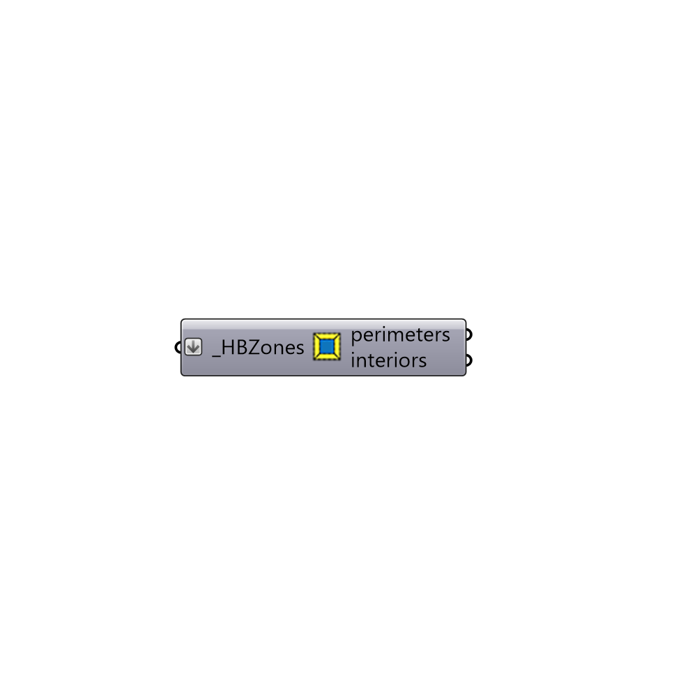

##  PerimeterCoreZoning - [[source code]](https://github.com/mostaphaRoudsari/honeybee/tree/master/src/Honeybee_PerimeterCoreZoning.py)

Separate zones into perimeter and core
 -
 

#### Inputs
* ##### HBZones [Required]
Script variable Python

#### Outputs
* ##### perimeters
Script output perimeters.
* ##### interiors
Script output interiors.

[Check Hydra Example Files for PerimeterCoreZoning](https://hydrashare.github.io/hydra/index.html?keywords=Honeybee_PerimeterCoreZoning)