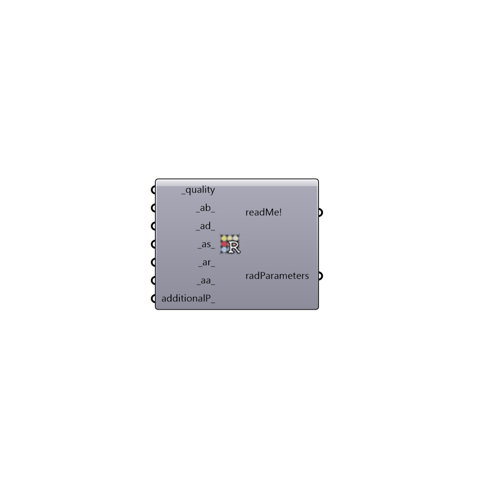

##  RADParameters - [[source code]](https://github.com/mostaphaRoudsari/honeybee/tree/master/src/Honeybee_RADParameters.py)

Radiance Parameters - Standard
 Check here for more details: http://radsite.lbl.gov/radiance/refer/Notes/rpict_options.html
 Read more about the parameters at: http://daysim.ning.com/
 Here is my favorite presentation by John Mardaljevic: http://radiance-online.org/community/workshops/2011-berkeley-ca/presentations/day1/JM_AmbientCalculation.pdf
 -
 

#### Inputs
* ##### quality [Required]
0 > low, 1 > Medium, 2 > High
* ##### ab [Default]
Number of ambient bounces. "This is the maximum number of diffuse bounces computed by the indirect calculation. A value of zero implies no indirect calculation. "
* ##### ad [Default]
Number of ambient divisions. "The error in the Monte Carlo calculation of indirect illuminance will be inversely proportional to the square root of this number. A value of zero implies no indirect calculation."
* ##### as [Default]
Number of ambient super-samples. "Super-samples are applied only to the ambient divisions which show a significant change."
* ##### ar [Default]
Ambient resolution. "This number will determine the maximum density of ambient values used in interpolation. Error will start to increase on surfaces spaced closer than the scene size divided by the ambient resolution. The maximum ambient value density is the scene size times the ambient accuracy."
* ##### aa [Default]
Ambient accuracy. "This value will approximately equal the error from indirect illuminance interpolation. A value of zero implies no interpolation"
* ##### additionalP [Optional]
Use this input to set other Radiance parameters as needed. You need to follow Radiance's standard syntax (e.g. -ps 1 -lw 0.01)

#### Outputs
* ##### readMe!
The execution information, as output and error streams
* ##### radParameters
Script output radParameters.

[Check Hydra Example Files for RADParameters](https://hydrashare.github.io/hydra/index.html?keywords=Honeybee_RADParameters)