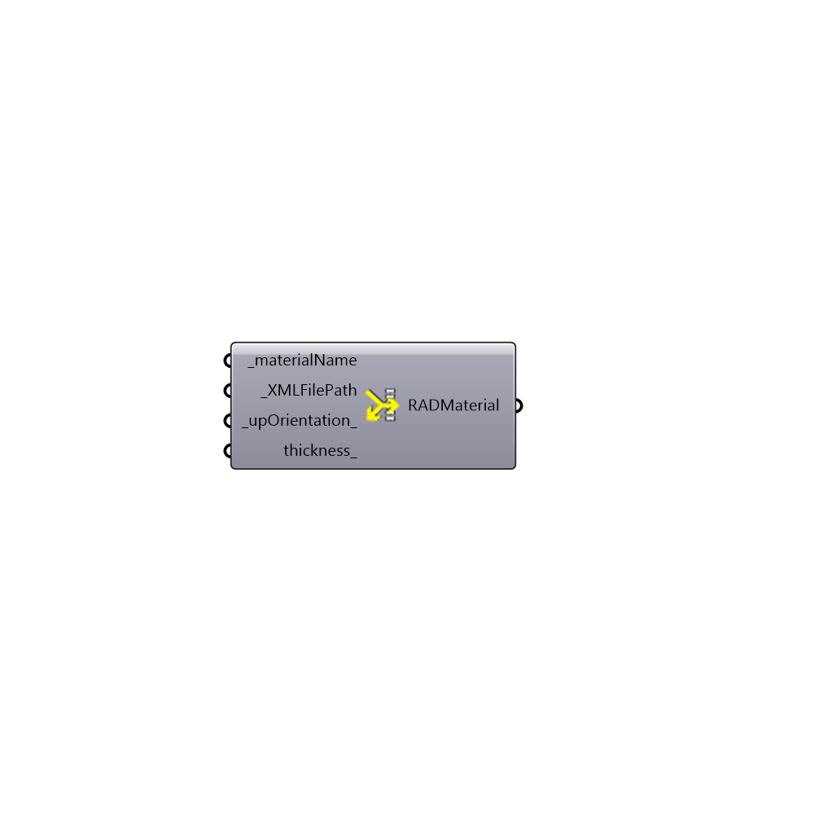

##  Radiance BSDF Material

Radiance BSDF Material
 Create RADIANCE BSDF material
 -
 

#### Inputs
* ##### materialName [Required]
Name of material for the Radiance simulation.
* ##### XMLFilePath [Required]
File path to XML that contains the BSDF information.
* ##### upOrientation [Default]
An optional vector that sets the hemisphere that the BSDF material faces.  For materials that are symmetrical about the HBSrf plane (like non-angled venitian blinds), this can be any vector that is not perfectly normal to the HBSrf. For asymmetrical materials like angled veneitan blinds, this variable should be coordinated with the direction the HBSrfs are facing.  The default is set to (0.01, 0.01, 1.00), which should hopefully not be perpendicular to any typical HBSrf.
* ##### thickness [Optional]
Optional parameter to set the thickness of the BSDF material.  The default is set to 0.

#### Outputs
* ##### RADMaterial
Radiance Material string

[Check Hydra Example Files for Radiance BSDF Material](https://hydrashare.github.io/hydra/index.html?keywords=Honeybee_Radiance BSDF Material)