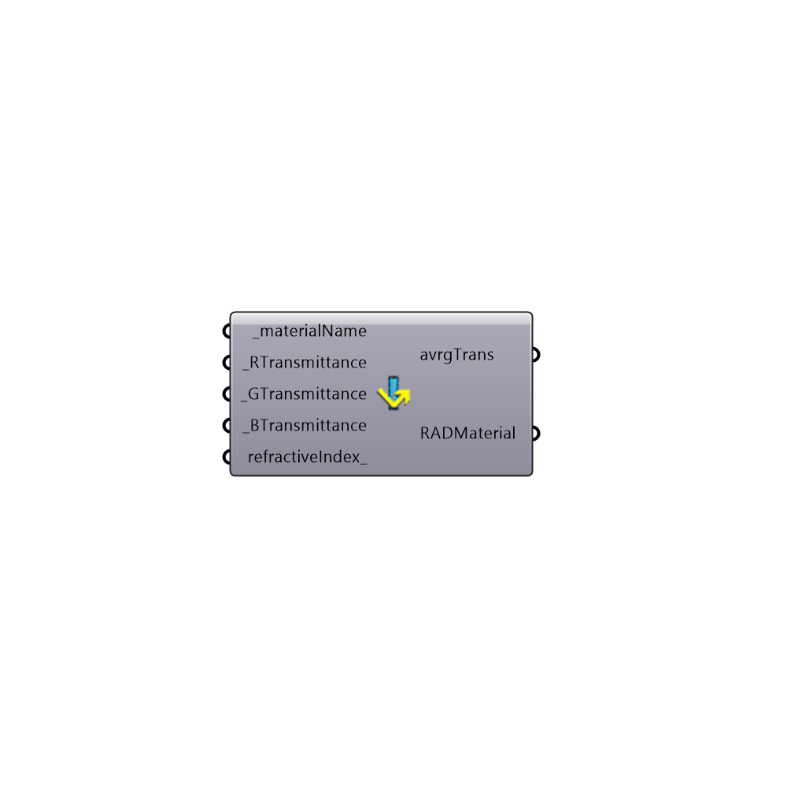

##  Radiance Glass Material

Radiance Glass Material
 Read more here to understand Radiance materials: http://www.artifice.com/radiance/rad_materials.html
 -
 

#### Inputs
* ##### materialName [Required]
Unique name for this material
* ##### RTransmittance [Required]
Transmittance for red. The value should be between 0 and 1
* ##### GTransmittance [Required]
Transmittance for green. The value should be between 0 and 1
* ##### BTransmittance [Required]
Transmittance for blue. The value should be between 0 and 1
* ##### refractiveIndex [Optional]
RefractiveIndex is 1.52 for glass and 1.4 for ETFE

#### Outputs
* ##### avrgTrans
Average transmittance of this glass
* ##### RADMaterial
Radiance Material string

[Check Hydra Example Files for Radiance Glass Material](https://hydrashare.github.io/hydra/index.html?keywords=Honeybee_Radiance Glass Material)