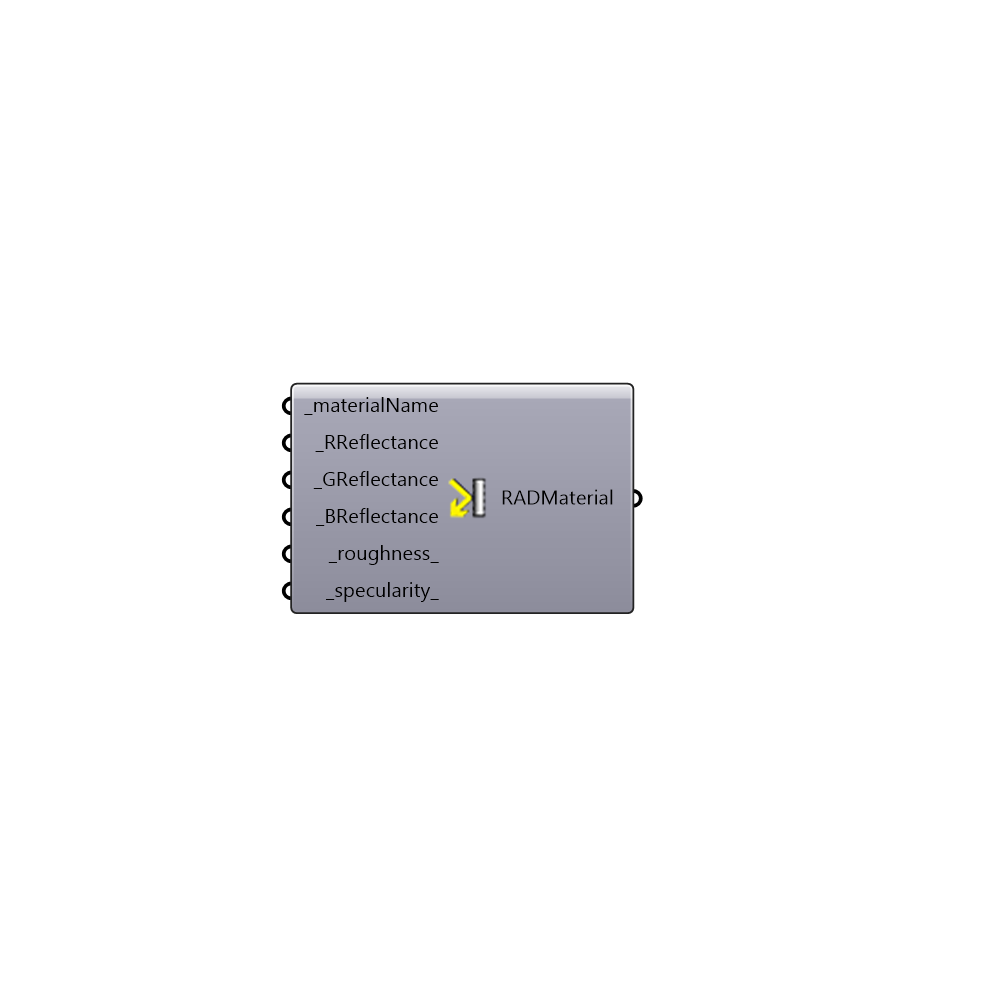

##  Radiance Metal Material

Radiance Opaque Material
 Create a Standard Radiance Opaque Material. Many thanks to Axel Jacobs for his help and all the great resources he provided at jaloxa.eu
 Check out the color picker to see some great examples > http://www.jaloxa.eu/resources/radiance/colour_picker/index.shtml
 -
 

#### Inputs
* ##### materialName [Required]
A unique name for material
* ##### RReflectance [Required]
Diffuse reflectance for red
* ##### GReflectance [Required]
Diffuse reflectance for green
* ##### BReflectance [Required]
Diffuse reflectance for blue
* ##### roughness [Default]
Roughness values above 0.2 are uncommon
* ##### specularity [Default]
Specularity values above 0.9 is typical for metal

#### Outputs
* ##### RADMaterial
Radiance Material string

[Check Hydra Example Files for Radiance Metal Material](https://hydrashare.github.io/hydra/index.html?keywords=Honeybee_Radiance Metal Material)