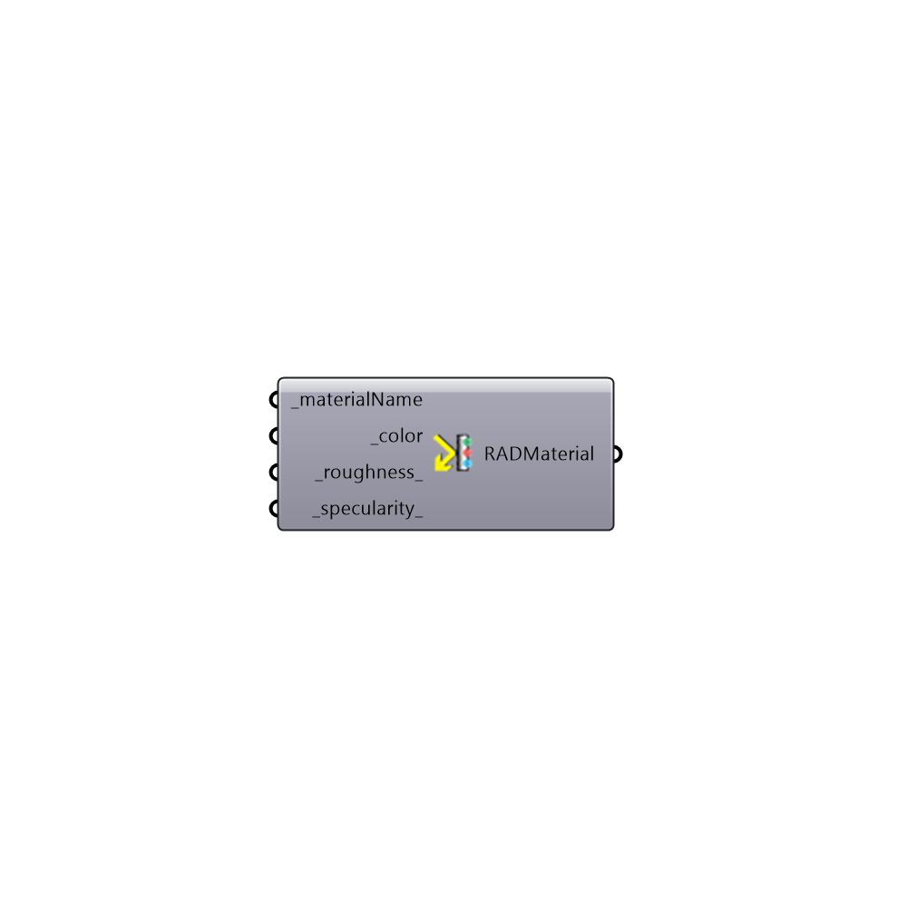

##  Radiance Metal Material By Color

Radiance Metal Material By Color
 Create a Standard Radiance Metal Material. Many thanks to Axel Jacobs for his help and all the great resources he provided at jaloxa.eu
 Check out the color picker to see some great examples > http://www.jaloxa.eu/resources/radiance/colour_picker/index.shtml
 -
 

#### Inputs
* ##### materialName [Required]
Material name
* ##### color [Required]
Material color
* ##### roughness [Default]
Roughness values above 0.2 are uncommon
* ##### specularity [Default]
Specularity values above 0.9 is typical for metal

#### Outputs
* ##### RADMaterial
Radiance Material string

[Check Hydra Example Files for Radiance Metal Material By Color](https://hydrashare.github.io/hydra/index.html?keywords=Honeybee_Radiance Metal Material By Color)