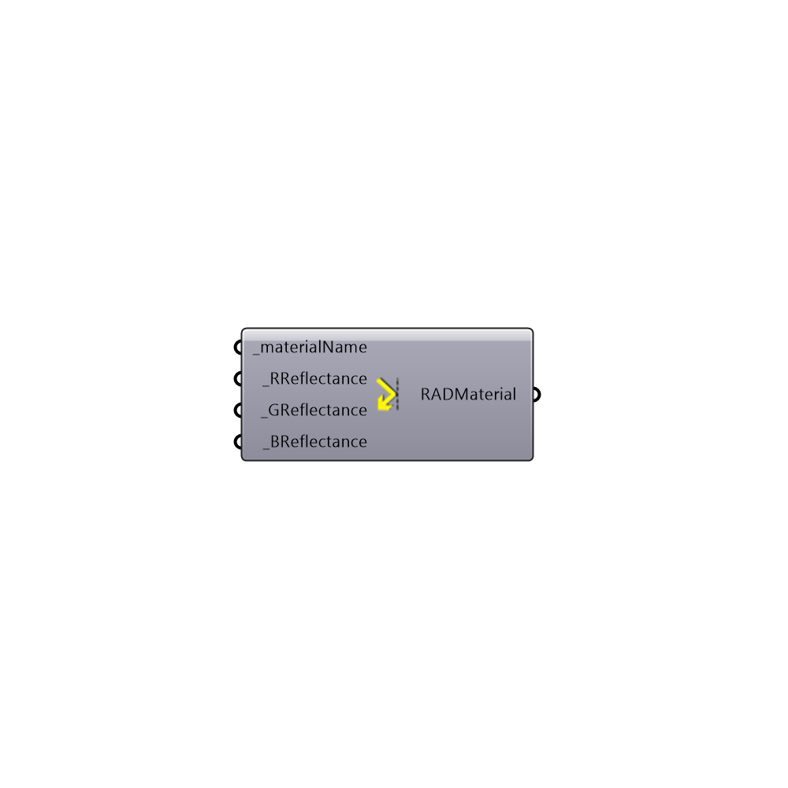

##  Radiance Mirror Material - [[source code]](https://github.com/ladybug-tools/honeybee-legacy/tree/master/src/Honeybee_Radiance%20Mirror%20Material.py)

Radiance Mirror Material
 Read more here to understand Radiance materials: http://www.artifice.com/radiance/rad_materials.html
 -
 

#### Inputs
* ##### materialName [Required]
Unique name for this material
* ##### RReflectance [Required]
Diffuse reflectance for red
* ##### GReflectance [Required]
Diffuse reflectance for green
* ##### BReflectance [Required]
Diffuse reflectance for blue

#### Outputs
* ##### RADMaterial
Radiance Material string

[Check Hydra Example Files for Radiance Mirror Material](https://hydrashare.github.io/hydra/index.html?keywords=Honeybee_Radiance Mirror Material)