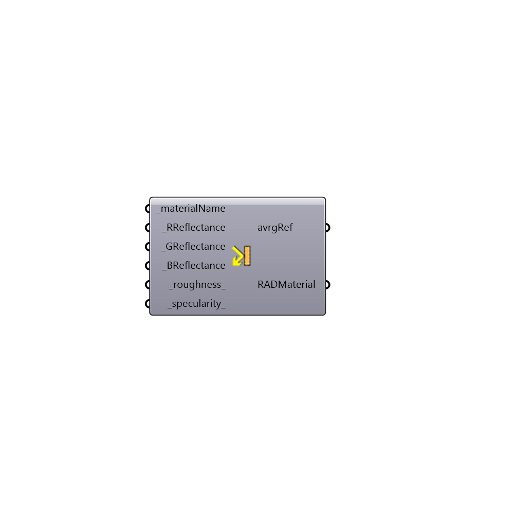

##  Radiance Opaque Material - [[source code]](https://github.com/ladybug-tools/honeybee-legacy/tree/master/src/Honeybee_Radiance%20Opaque%20Material.py)

Radiance Opaque Material
 Create a Standard Radiance Opaque Material. Many thanks to Axel Jacobs for his help and all the great resources he provided at jaloxa.eu
 Check out the color picker to see some great examples > http://www.jaloxa.eu/resources/radiance/colour_picker/index.shtml
 -
 

#### Inputs
* ##### materialName [Required]
Script input materialName.
* ##### RReflectance [Required]
Diffuse reflectance for red
* ##### GReflectance [Required]
Diffuse reflectance for green
* ##### BReflectance [Required]
Diffuse reflectance for blue
* ##### roughness [Default]
Roughness values above 0.2 are uncommon
* ##### specularity [Default]
Specularity values above 0.1 are uncommon

#### Outputs
* ##### avrgRef
Average diffuse reflectance of the material
* ##### RADMaterial
Radiance Material string

[Check Hydra Example Files for Radiance Opaque Material](https://hydrashare.github.io/hydra/index.html?keywords=Honeybee_Radiance Opaque Material)