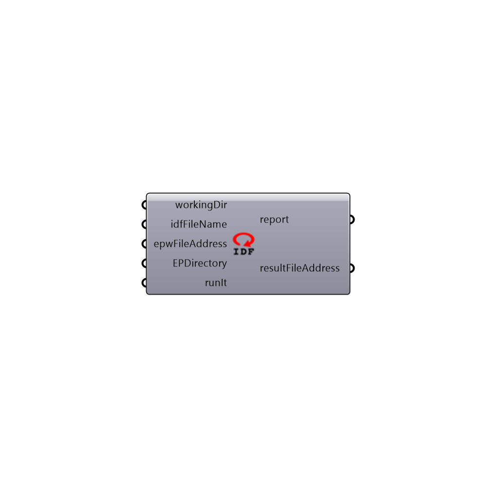

##  Re-run IDF - [[source code]](https://github.com/ladybug-tools/honeybee-legacy/tree/master/src/Honeybee_Re-run%20IDF.py)

This is a component for running a previoulsy-generated .idf file through EnergyPlus.
 -
 

#### Inputs
* ##### idfFilePath [Required]
The full file path to the idf file on your system that you would like to run (e.g. C:\ladybug\sample1.idf).
* ##### epwFileAddress [Required]
The full file path to epw weather file that you would like the simulation to run with.
* ##### parallel [Optional]
Set to "True" to run multiple IDFs using multiple CPUs.  Note that this input is only relevant when you have plugged in a list of IDF file addresses.
* ##### runIt [Required]
Set to 'True' to run the simulation.

#### Outputs
* ##### report
Report!
* ##### resultFileAddress
The address of the EnergyPlus result file.
* ##### eioFileAddress
The file path of the EIO file that has been generated on your machine.  This file contains information about the sizes of all HVAC equipment from the simulation.  This file is only generated when you set "runSimulation_" to "True."
* ##### rddFileAddress
The file path of the Result Data Dictionary (.rdd) file that is generated after running the file through EnergyPlus.  This file contains all possible outputs that can be requested from the EnergyPlus model.  Use the "Honeybee_Read Result Dictionary" to see what outputs can be requested.

[Check Hydra Example Files for Re-run IDF](https://hydrashare.github.io/hydra/index.html?keywords=Honeybee_Re-run IDF)