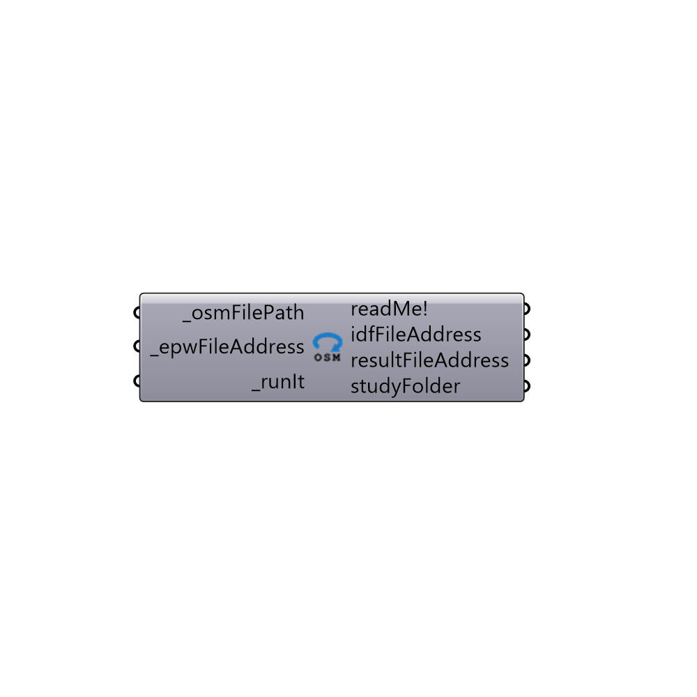

##  Re-run OSM - [[source code]](https://github.com/ladybug-tools/honeybee-legacy/tree/master/src/Honeybee_Re-run%20OSM.py)

This is a component for running a previoulsy-generated .osm file through EnergyPlus.
 -
 

#### Inputs
* ##### osmFilePath [Required]
A full file path to an OpenStdio Model (.osm) file.
* ##### epwFileAddress [Required]
A full file path to an epw weather file.
* ##### parallel [Optional]
Set to "True" to run multiple IDFs using multiple CPUs.  Note that this input is only relevant when you have plugged in a list of OSM file addresses.
* ##### runIt [Required]
Set to "True" to have the component generate an IDF file from the OSM file and run the IDF through through EnergyPlus.  Set to "False" to not run the file (this is the default).  You can also connect an integer for the following options:
 0 = Do Not Run OSM and IDF thrrough EnergyPlus
 1 = Run the OSM and IDF through EnergyPlus with a command prompt window that displays the progress of the simulation
 2 = Run the OSM and IDF through EnergyPlus in the background (without the command line popup window).
 3 = Generate an IDF from the OSM file but do not run it through EnergyPlus

#### Outputs
* ##### readMe!
Report!
* ##### idfFileAddress
The file path of the IDF file that has been generated on your machine. This file is only generated when you set "runSimulation_" to "True."
* ##### resultFileAddress
The address of the EnergyPlus result file.
* ##### eioFileAddress
The file path of the EIO file that has been generated on your machine.  This file contains information about the sizes of all HVAC equipment from the simulation.  This file is only generated when you set "runSimulation_" to "True."
* ##### rddFileAddress
The file path of the Result Data Dictionary (.rdd) file that is generated after running the file through EnergyPlus.  This file contains all possible outputs that can be requested from the EnergyPlus model.  Use the "Honeybee_Read Result Dictionary" to see what outputs can be requested.

[Check Hydra Example Files for Re-run OSM](https://hydrashare.github.io/hydra/index.html?keywords=Honeybee_Re-run OSM)