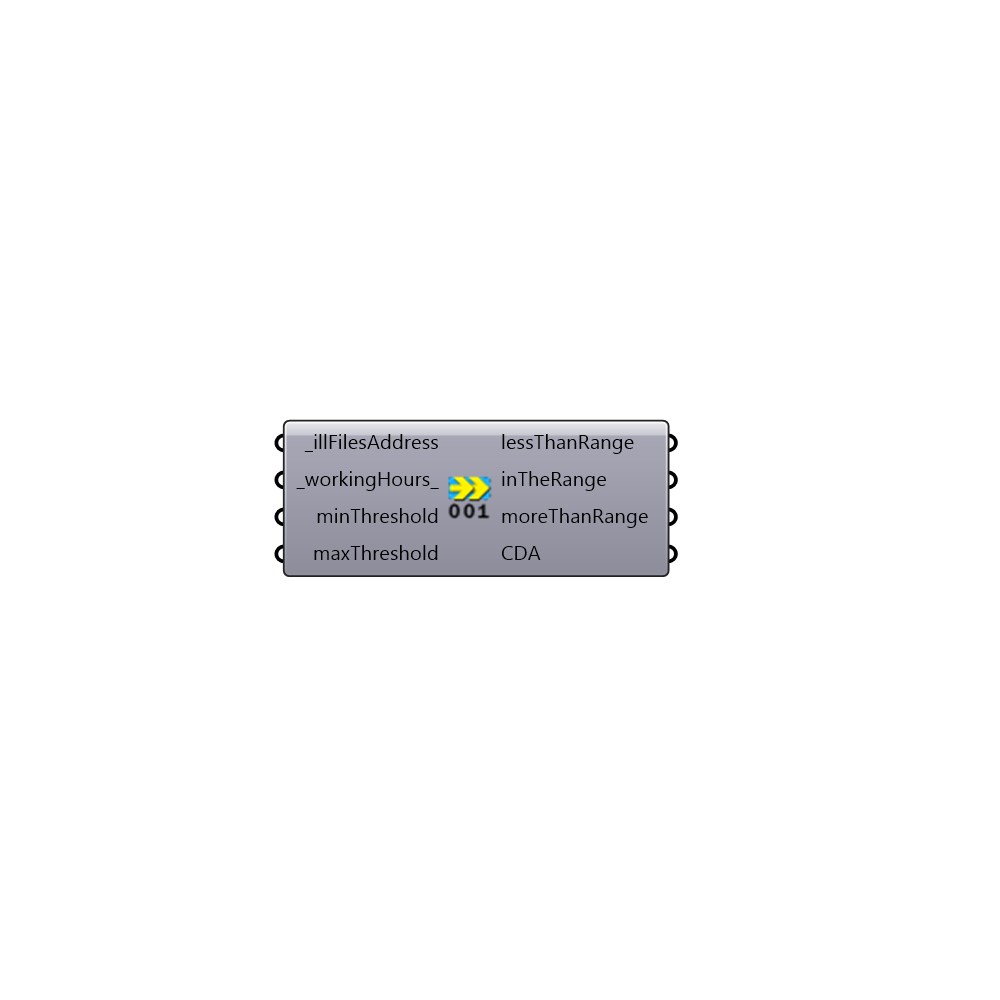

##  ReadAnnualResultsIII - [[source code]](https://github.com/mostaphaRoudsari/honeybee/tree/master/src/Honeybee_ReadAnnualResultsIII.py)

read the annual ill files very fast!!  Please find the source code from: https://github.com/MingboPeng/Ironbug

#### Inputs
* ##### illFilesAddress [Required]
A list of .ill files generated by Radiance
* ##### workingHours [Default]
a list of hours in 24H pormat, by default is from 8 - 18 (LEED v4)
* ##### minThreshold []
Default 300lux.
* ##### maxThreshold []
Default 0 (infinity).

#### Outputs
* ##### lessThanRange
% of total hours that is less than the minimum threshold
* ##### inTheRange
% of total hours that is between the minimum and maximum threshold
* ##### moreThanRange
% of total hours that is larger than the maximum threshold
* ##### CDA
% of total hours that is between the minimum and maximum threshold, with partial credits

[Check Hydra Example Files for ReadAnnualResultsIII](https://hydrashare.github.io/hydra/index.html?keywords=Honeybee_ReadAnnualResultsIII)