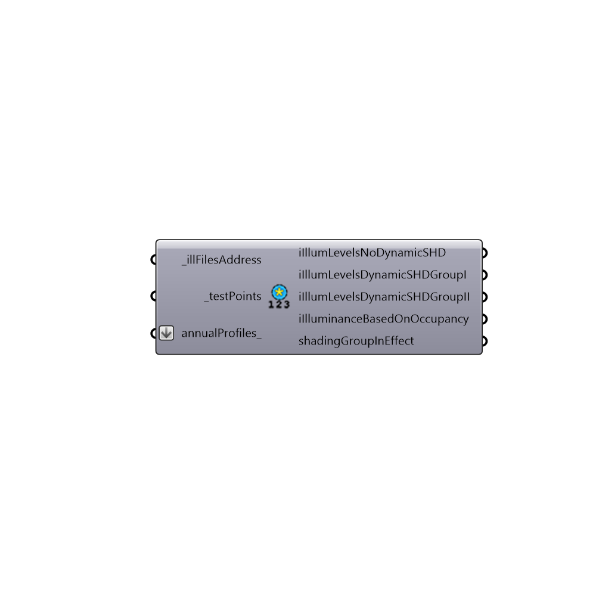

##  Read All the Hourly Results from Annual Daylight Study - [[source code]](https://github.com/mostaphaRoudsari/honeybee/tree/master/src/Honeybee_Read%20All%20the%20Hourly%20Results%20from%20Annual%20Daylight%20Study.py)

Read the results of the annual study for a all the hours of the year for all the points
 -
 

#### Inputs
* ##### illFilesAddress [Required]
List of .ill files
* ##### testPoints [Required]
List of 3d Points
* ##### annualProfiles [Optional]
Script variable readDSHourlyResults

#### Outputs
* ##### iIllumLevelsNoDynamicSHD
Illuminance values without dynamic shadings
* ##### iIllumLevelsDynamicSHDGroupI
Illuminance values when shading group I is closed
* ##### iIllumLevelsDynamicSHDGroupII
Illuminance values when shading group II is closed
* ##### iIlluminanceBasedOnOccupancy
Illuminance values based on Daysim user behavior
* ##### shadingGroupInEffect
0: no blind, 1: shading group I, 2: shading group II

[Check Hydra Example Files for Read All the Hourly Results from Annual Daylight Study](https://hydrashare.github.io/hydra/index.html?keywords=Honeybee_Read All the Hourly Results from Annual Daylight Study)