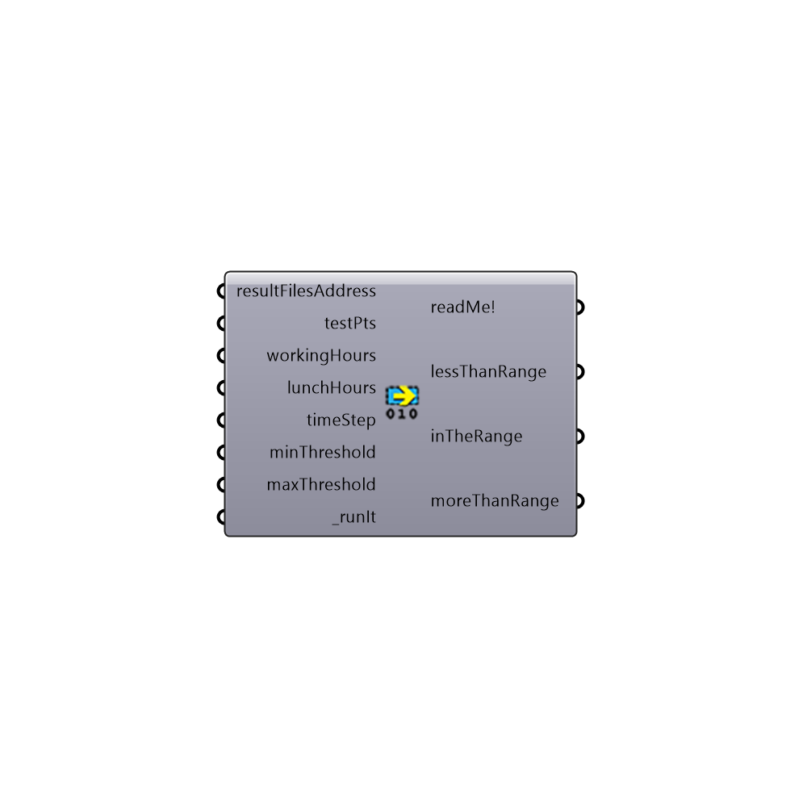

##  Read Annual Result II - [[source code]](https://github.com/ladybug-tools/honeybee-legacy/tree/master/src/Honeybee_Read%20Annual%20Result%20II.py)

Read Annual Daylight Results II [Daysim]
 -
 

#### Inputs
* ##### resultFilesAddress []
List of .ill files
* ##### testPts []
List of 3d Points
* ##### workingHours []
A domain that indicates start and the end hour of tha study. Default is from 8 to 17.
* ##### lunchHours []
A domain that indicates start and end of the hours off during the day
* ##### timeStep []
Timestep for the annual study. Default is 1.
* ##### minThreshold []
Minimum of desired value (default is illuminance and 300 lux)
* ##### maxThreshold []
Maximum of desired value (default is infinite)
* ##### runIt [Required]
Script variable readAnnualResultsII

#### Outputs
* ##### readMe!
...
* ##### lessThanRange
Percentage of the time that the value is less than desired value
* ##### inTheRange
Percentage of the time that the value is between minimum and maximum Thresholds
* ##### moreThanRange
Percentage of the time that the value is more than desired value

[Check Hydra Example Files for Read Annual Result II](https://hydrashare.github.io/hydra/index.html?keywords=Honeybee_Read Annual Result II)