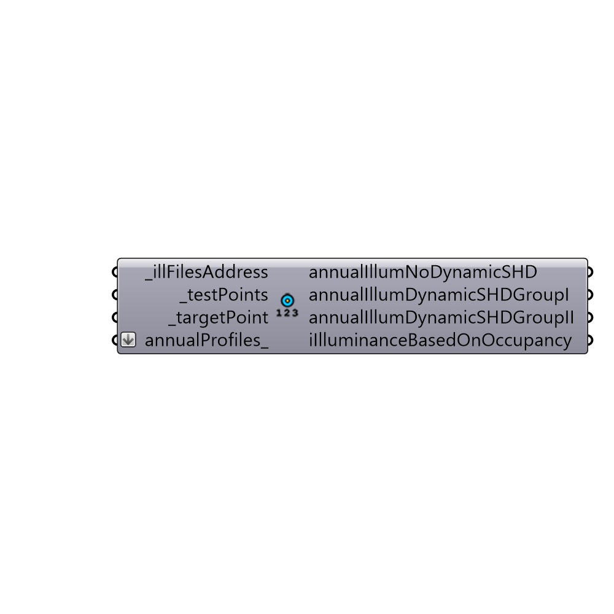

##  Read DS Result for a point - [[source code]](https://github.com/ladybug-tools/honeybee-legacy/tree/master/src/Honeybee_Read%20DS%20Result%20for%20a%20point.py)

Read Daysim result for a test point
 -
 

#### Inputs
* ##### illFilesAddress [Required]
List of .ill files
* ##### testPoints [Required]
List of 3d Points
* ##### targetPoint [Required]
One of the points from the test points
* ##### annualProfiles [Optional]
Script variable Python

#### Outputs
* ##### annualIllumNoDynamicSHD
Script variable Python
* ##### annualIllumDynamicSHDGroupI
Script variable Python
* ##### annualIllumDynamicSHDGroupII
Script variable Python
* ##### iIlluminanceBasedOnOccupancy
Illuminance values based on Daysim user behavior

[Check Hydra Example Files for Read DS Result for a point](https://hydrashare.github.io/hydra/index.html?keywords=Honeybee_Read DS Result for a point)