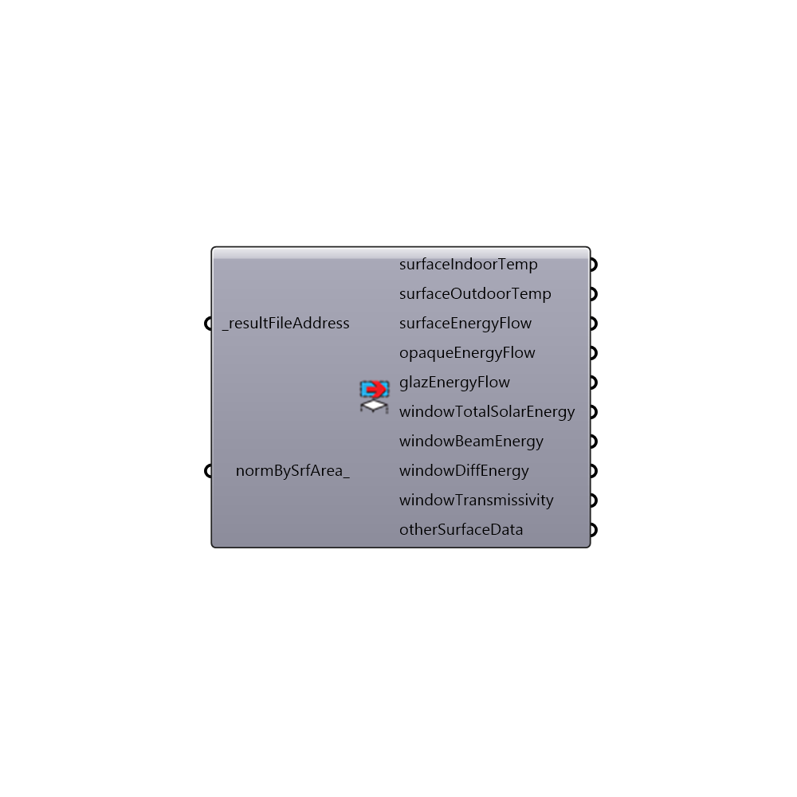

##  Read EP Surface Result - [[source code]](https://github.com/mostaphaRoudsari/honeybee/tree/master/src/Honeybee_Read%20EP%20Surface%20Result.py)

This component reads the results of an EnergyPlus simulation from the WriteIDF Component or any EnergyPlus result .csv file address.  Note that, if you use this component without the WriteIDF component, you should make sure that a corresponding .eio file is next to your .csv file at the input address that you specify.
 _
 This component reads only the results related to surfaces.  For results related to zones, you should use the "Honeybee_Read EP Result" component.
 -
 

#### Inputs
* ##### resultFileAddress [Required]
The result file address that comes out of the WriteIDF component.
* ##### normBySrfArea [Optional]
Set to 'True' to normalize all surface energy data by the area of the suraces (note that the resulting units will be kWh/m2 as EnergyPlus runs in the metric system).  The default is set to "False."

#### Outputs
* ##### surfaceIndoorTemp
The indoor surface temperature of each surface (degrees Celcius).
* ##### surfaceOutdoorTemp
The outdoor surface temperature of each surface (degrees Celcius).
* ##### surfaceEnergyFlow
The heat loss (negative) or heat gain (positive) through each building surfaces (kWh).
* ##### opaqueEnergyFlow
The heat loss (negative) or heat gain (positive) through each building opaque surface (kWh).
* ##### glazEnergyFlow
The heat loss (negative) or heat gain (positive) through each building glazing surface (kWh).  Note that the value here includes both solar gains and conduction losses/gains.
* ##### windowTotalSolarEnergy
The total solar energy transmitted through each of the glazing surfaces to the zone (kWh).
* ##### windowBeamEnergy
The total direct solar beam energy transmitted through each of the glazing surfaces to the zone (kWh).
* ##### windowDiffEnergy
The total diffuse solar energy transmitted through each of the glazing surfaces to the zone (kWh).
* ##### windowTransmissivity
The hourly transmissivity of the exterior windows of the model.  This data is needed to align a comfort map with an energy model possessing shades.

[Check Hydra Example Files for Read EP Surface Result](https://hydrashare.github.io/hydra/index.html?keywords=Honeybee_Read EP Surface Result)