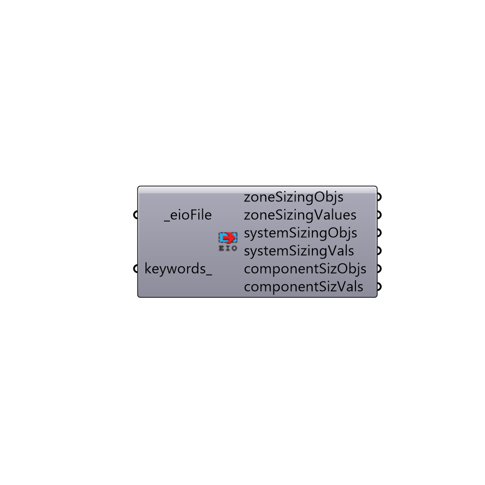

##  Read HVAC Sizing - [[source code]](https://github.com/mostaphaRoudsari/honeybee/tree/master/src/Honeybee_Read%20HVAC%20Sizing.py)

This component parses an .eio file from an energy simulation and brings in the sizes of all of the HVAC equipment.
 -
 

#### Inputs
* ##### eioFile [Required]
The file address of the eio file that comes out of the "Honeybee_Lookup EnergyPlus Folder" component.
* ##### keywords [Optional]
Optional keywords that will be used to search through the outputs.

#### Outputs
* ##### zonePeakLoadObjs
Text describing the meaning of the zonePeakLoadVals below.
* ##### zonePeakLoadVals
The sum of the zone's peak sensible loads on the design days.  These are eventually used to size the HVAC equipment that delivers heating/cooling to the zones.
* ##### zoneSizingObjs
Text describing the meaning of the zoneSizingValues below.
* ##### zoneSizingValues
The zone's peak sensible loads multiplied by their respective design "safety" factors (set on the "Energy Simulation Par" component). These safety factors are used to slightly oversize zone heating/cooling equipment and is standard ASHRAE practice.
* ##### systemSizingObjs
Text describing the meaning of the systemSizingVals below.
* ##### systemSizingVals
Values denoting the size of various central HVAC system elemts (like the primary air loop flow rates).
* ##### componentSizObjs
Text describing the meaning of the componentSizVals below.
* ##### componentSizVals
Values denoting the size of various zone HVAC components (like zone terminal sizes, heating/cooling coil sizes, lengths of chilled beams, etc.).

[Check Hydra Example Files for Read HVAC Sizing](https://hydrashare.github.io/hydra/index.html?keywords=Honeybee_Read HVAC Sizing)