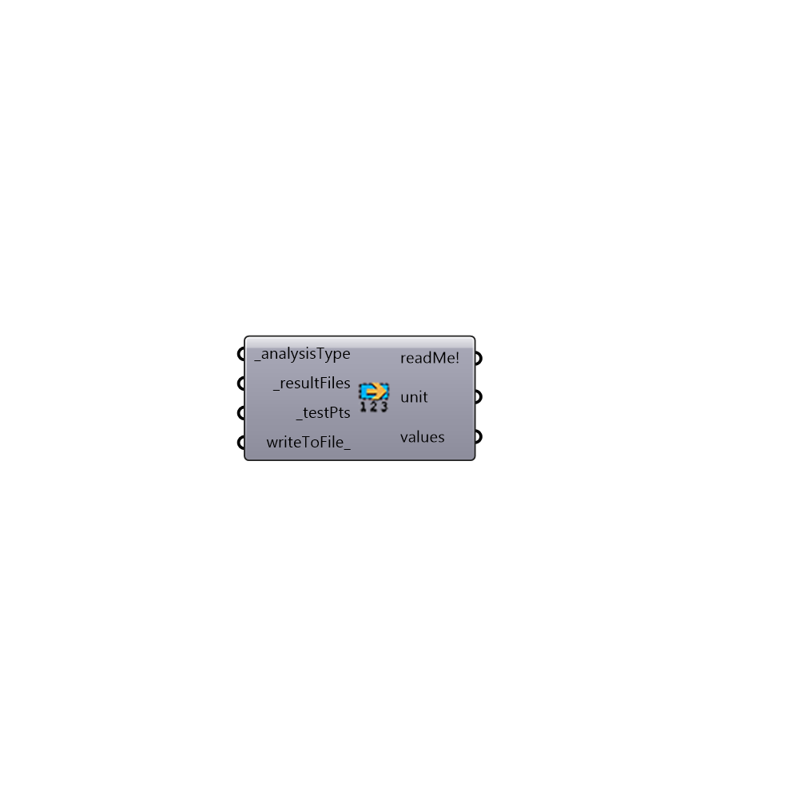

##  Read RAD Result

Read Radiance Results
 -
 

#### Inputs
* ##### analysisType [Required]
[0] illuminance, [1] radiation, [2] luminance, [3] daylight factor, [4] vertical sky component
* ##### resultFiles [Required]
A list of result files
* ##### testPts [Required]
A list of 3d test points
* ##### writeToFile [Optional]
set to True if you want the final results be saves as a text file

#### Outputs
* ##### readMe!
...
* ##### unit
Unit of the results
* ##### values
Result of the analysis

[Check Hydra Example Files for Read RAD Result](https://hydrashare.github.io/hydra/index.html?keywords=Honeybee_Read RAD Result)