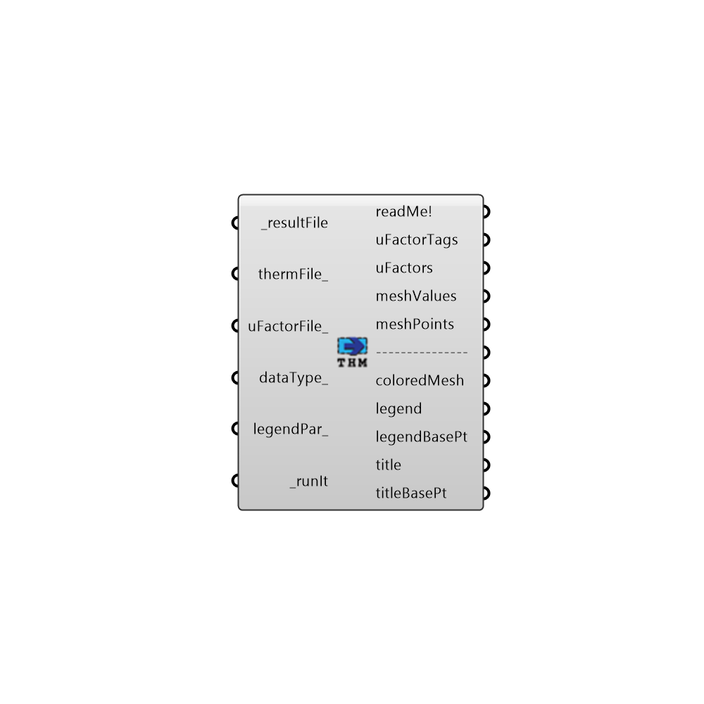

##  Read THERM Result - [[source code]](https://github.com/ladybug-tools/honeybee-legacy/tree/master/src/Honeybee_Read%20THERM%20Result.py)

Use this component to import the colored mesh results from a THERM simulation.  Note that, because the THERM API version is not free, you will have to open the file generated by run the "Write THERM File" component are run it yourself (maybe in the future, we will be able to launch it from the command line).
 _
 Before you run the file in THERM, make sure that you go to Options > Preferences > Simulation and check "Save Conrad results file (.O)" in order to enure that your THERM simulation writes all results out in a format that this component understands.
 -
 

#### Inputs
* ##### resultFile [Required]
The resultFileAddress from the "Write THERM File" component.  Make sure that you have opened THERM and run your file before using this component. Also, before you run the file in THERM, make sure that you go to Options > Preferences > Simulation and check "Save Conrad results file (.O)" in order to enure that your THERM simulation writes this file.
* ##### uFactorFile [Optional]
An optional path to a THERM file that has been saved after importing and simulating files generated with the 'Honeybee_Write THERM File' component. Before you run the file in THERM, make sure that you go to Options > Preferences > Preferences and check "Automatic XML Export on Save" in order to enure that your THERM simulation writes this uFactorFile.
* ##### thermFile [Optional]
An optional filepath to a THERM file that has been generated with the 'Honeybee_Write THERM File' component.  The header of this file contains information on the transformations used to map the original geometry between Rhino space and the THERM canvas.  As a result, connecting a file here ensures that imported results happen on top of the original Rhino geometry.  If no file address is connected here, the THERM results are imported with their THERM canvass coordinates.
* ##### dataType [Optional]
An optional integer to set the type of data to import.  If left blank, this component will import the temperature data.  Choose from the following two options:
 0 - Temperature (temperature meshValues at each point in C)
 1 - Heat Flux (heat flux meshValues at each point in W/m2)
* ##### SIorIP [Optional]
Set to 'True' to have all data imported with SI units (Celcius and W/m2) and set to 'False' to have all data imported with IP Units (Farenheit and BTU/ft2).  The default is set to 'True' for SI.
* ##### legendPar [Optional]
Optional legend parameters from the Ladybug "Legend Parameters" component.
* ##### runIt [Required]
Script variable Python

#### Outputs
* ##### uFactorTags
The names of each of the uFactor tags (including information about projections for each of the tags).
* ##### uFactors
The U-Factors accross each boundary condition that has been definted with a uFactorTag. This will be in W/m2-K if SIorIP is set to 'True'  or in BTU/h-ft2-F if set to 'False.'
* ##### uFactorLength
The lengths of the boundary condition defined by the U-Factor tags.  This will be in mm if SIorIP is set to 'True'  or in inches if set to 'False.'
* ##### deltaT
The temperature delta across each of the uFactor tags.
* ##### meshValues
The numerical meshValues of the results in either degrees C or W/m2 (depending on the dataType_ input of this component).
* ##### meshPoints
The meshPoints of the mesh that THERM has generated.
* ##### coloredMesh
A mesh of the original THERM geometry that is colored with the results.
* ##### legend
A legend for the coloredMesh above. Connect this output to a grasshopper "Geo" component in order to preview this legend separately in the Rhino scene.  
* ##### legendBasePt
The legend base point, which can be used to move the legend in relation to the newMesh with the grasshopper "move" component.
* ##### title
The title text of the results.  Hook this up to a native Grasshopper 'Geo' component to preview it separately from the other outputs.
* ##### titleBasePt
Point for the placement of the title, which can be used to move the title in relation to the chart with the native Grasshopper "Move" component.

[Check Hydra Example Files for Read THERM Result](https://hydrashare.github.io/hydra/index.html?keywords=Honeybee_Read THERM Result)