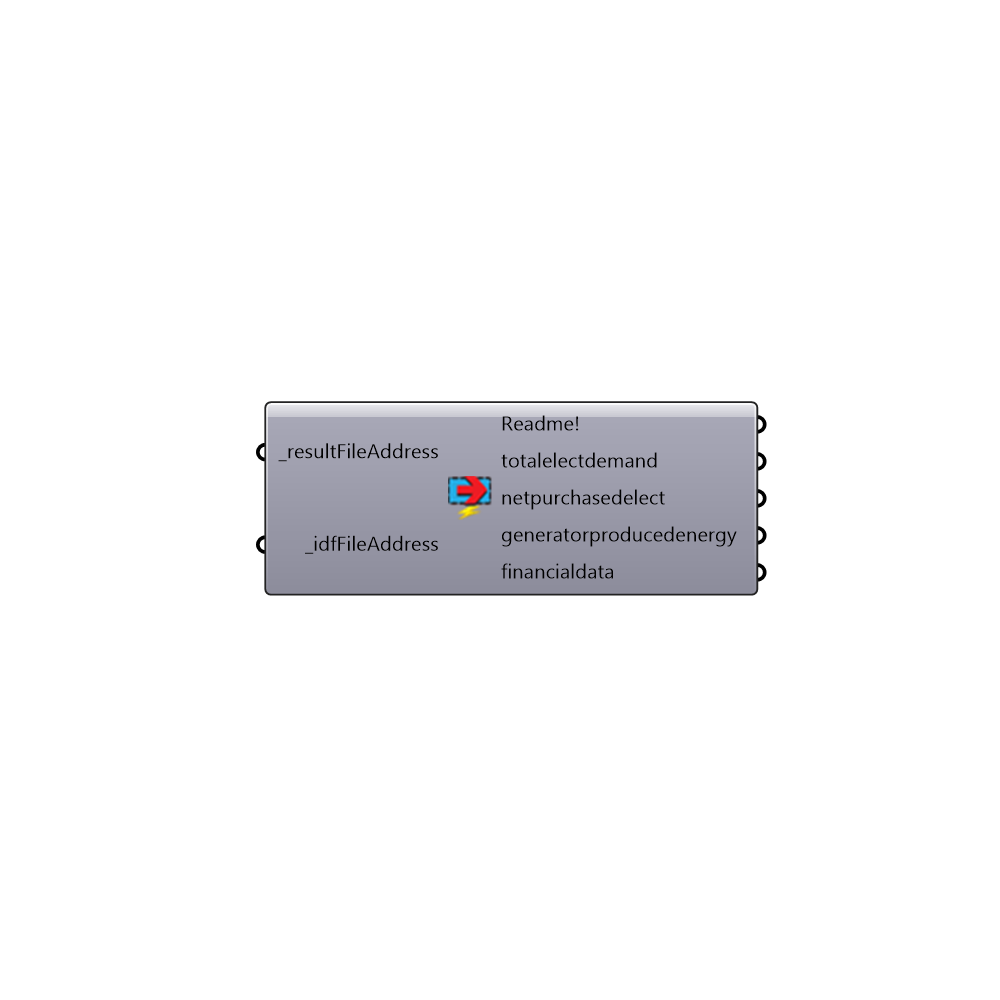

##  Read_generation_system_results - [[source code]](https://github.com/mostaphaRoudsari/honeybee/tree/master/src/Honeybee_Read_generation_system_results.py)

This component reads the results of an EnergyPlus simulation from the WriteIDF Component or any EnergyPlus result .csv file address.  Note that, if you use this component without the WriteIDF component, you should make sure that a corresponding .eio file is next to your .csv file at the input address that you specify.
 _
 This component reads only the results related to Honeybee generation systems.  For other results related to zones, you should use the "Honeybee_Read EP Result" for HVAC use the "Honeybee_Read EP HVAC Result" component and, for results related to surfaces, you should use the "Honeybee_Read EP Surface Result" component.
 -
 

#### Inputs
* ##### resultFileAddress [Required]
The result file address that comes out of the WriteIDF component.
* ##### idfFileAddress [Required]
The IDF file address that comes out of the WriteIDF component.

#### Outputs
* ##### Readme!
The execution information, as output and error streams
* ##### totalelectdemand
The total electricity demand of the facility in Kwh
* ##### netpurchasedelect
The net purchased electricity of the facility in Kwh
 - a negative value means that the facility produced surplus electricity and it was
 sold to the grid.
* ##### generatorproducedenergy
The electricity produced by each Honeybee generator in the facility
* ##### financialdata
The financial data of the Honeybee generators in the facility.

[Check Hydra Example Files for Read_generation_system_results](https://hydrashare.github.io/hydra/index.html?keywords=Honeybee_Read_generation_system_results)