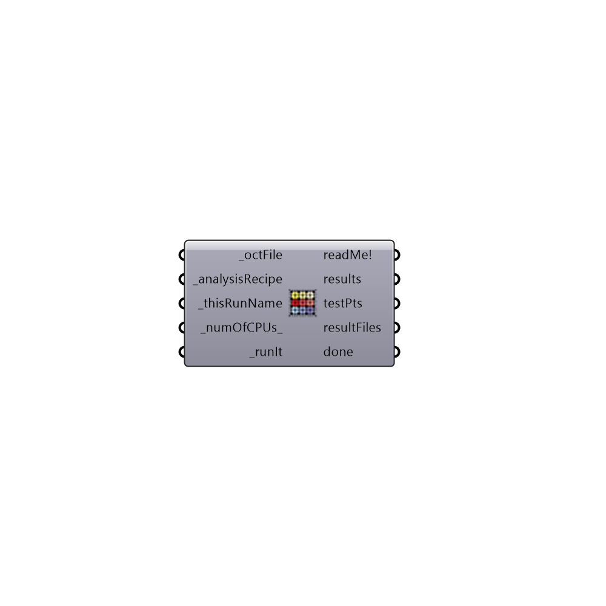

##  Refine Daylight Simulation - [[source code]](https://github.com/mostaphaRoudsari/honeybee/tree/master/src/Honeybee_Refine%20Daylight%20Simulation.py)

Refine simulation for an existing Radiance scene (.oct file)
 -
 

#### Inputs
* ##### octFile [Required]
Script variable Python
* ##### analysisRecipe [Required]
An analysis recipe
* ##### thisRunName [Required]
Name of this run so you can recognize it later
* ##### numOfCPUs [Default]
Number of CPUs to be used for the studies. This option doesn't work for image-based analysis
* ##### runIt [Required]
Script input _runIt.

#### Outputs
* ##### readMe!
The execution information, as output and error streams
* ##### results
Script variable runDaylightAnalysis
* ##### testPts
Test points if any
* ##### resultFiles
Result files. You need to need other components based on the type of the analysis to calculate the results
* ##### done
True if the study is over

[Check Hydra Example Files for Refine Daylight Simulation](https://hydrashare.github.io/hydra/index.html?keywords=Honeybee_Refine Daylight Simulation)