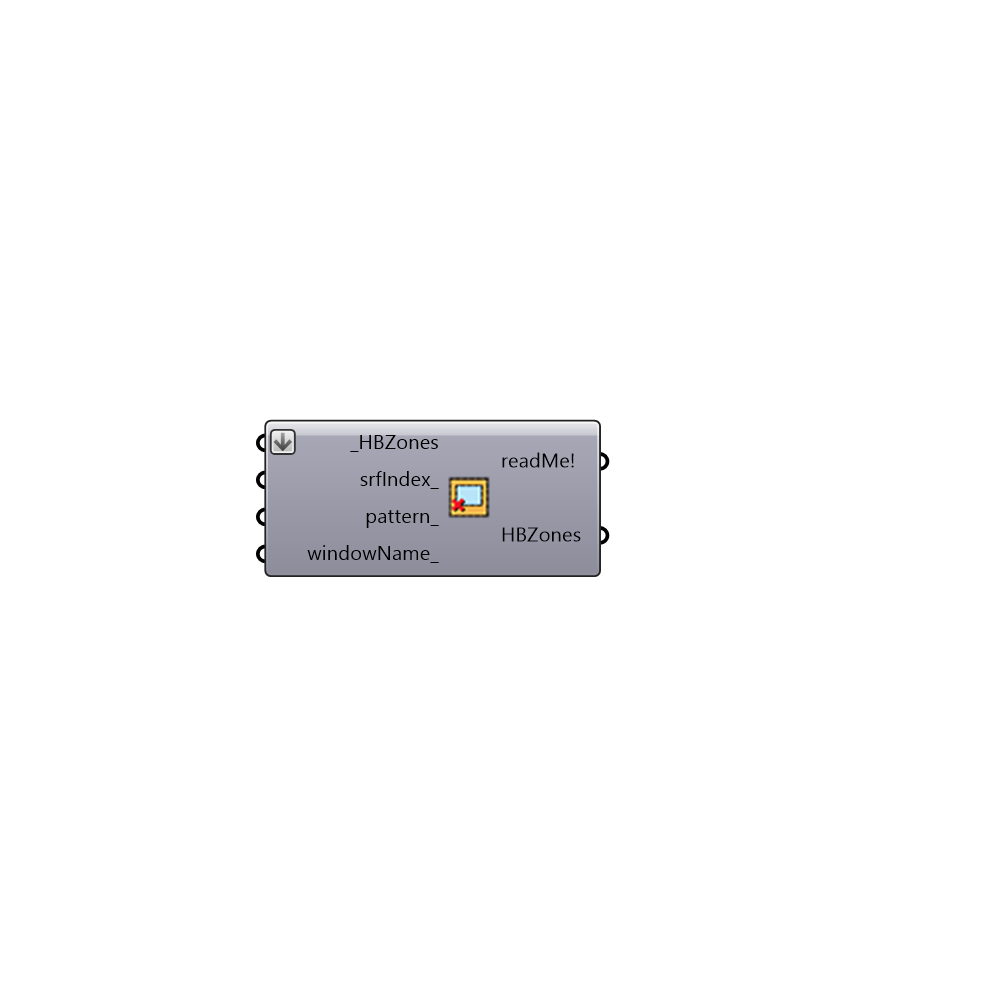

##  Remove Glazing - [[source code]](https://github.com/mostaphaRoudsari/honeybee/tree/master/src/Honeybee_Remove%20Glazing.py)

Remove Glazing 
 -
 

#### Inputs
* ##### HBZones [Required]
A list of Honeybee Zones, this component can only use Honeybee Zones
* ##### srfIndex [Optional]
Currently not functional do not connect anything here...
* ##### pattern [Optional]
Currently not functional do not connect anything here...
* ##### windowName [Optional]
The names of windows to remove, you can get the names of windows from the surfaceTxtLabels output of the component Honeybee_Label Zone Surfaces.

#### Outputs
* ##### readMe!
Information about the Honeybee object
     # Pattern to remove glazings from surfaces. E.g a list of True,False will remove every second glazing assuming every surface in each Honeybee zone has a glazing.
* ##### HBZones
Script variable changeName

[Check Hydra Example Files for Remove Glazing](https://hydrashare.github.io/hydra/index.html?keywords=Honeybee_Remove Glazing)