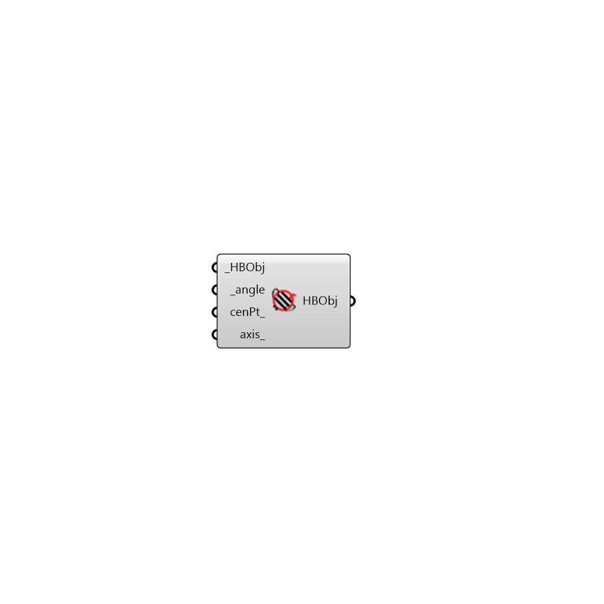

##  Rotate Honeybee - [[source code]](https://github.com/ladybug-tools/honeybee-legacy/tree/master/src/Honeybee_Rotate%20Honeybee.py)

Rotate Honeybee Objects
 -
 

#### Inputs
* ##### HBObj [Required]
Script variable Python
* ##### angle [Required]
Angle of rotation in degrees
* ##### cenPt [Optional]
Script variable moveHBObj
* ##### axis [Optional]
Optional rotation axis as a vector. Default is Z Axis
* ##### name [Default]
An optional text string that will be appended to the name of the transformed object(s).  If nothing is input here, a default unique name will be generated.
* ##### keepAdj [Optional]
Set to 'False' to remove existing adjacencies and boundary conditions (this is useful if you plan to re-solve adjacencies after this component). If left blank or set to 'True', the component will preserve adjacencies with other zones.

#### Outputs
* ##### HBObj
Script variable moveHBObj

[Check Hydra Example Files for Rotate Honeybee](https://hydrashare.github.io/hydra/index.html?keywords=Honeybee_Rotate Honeybee)