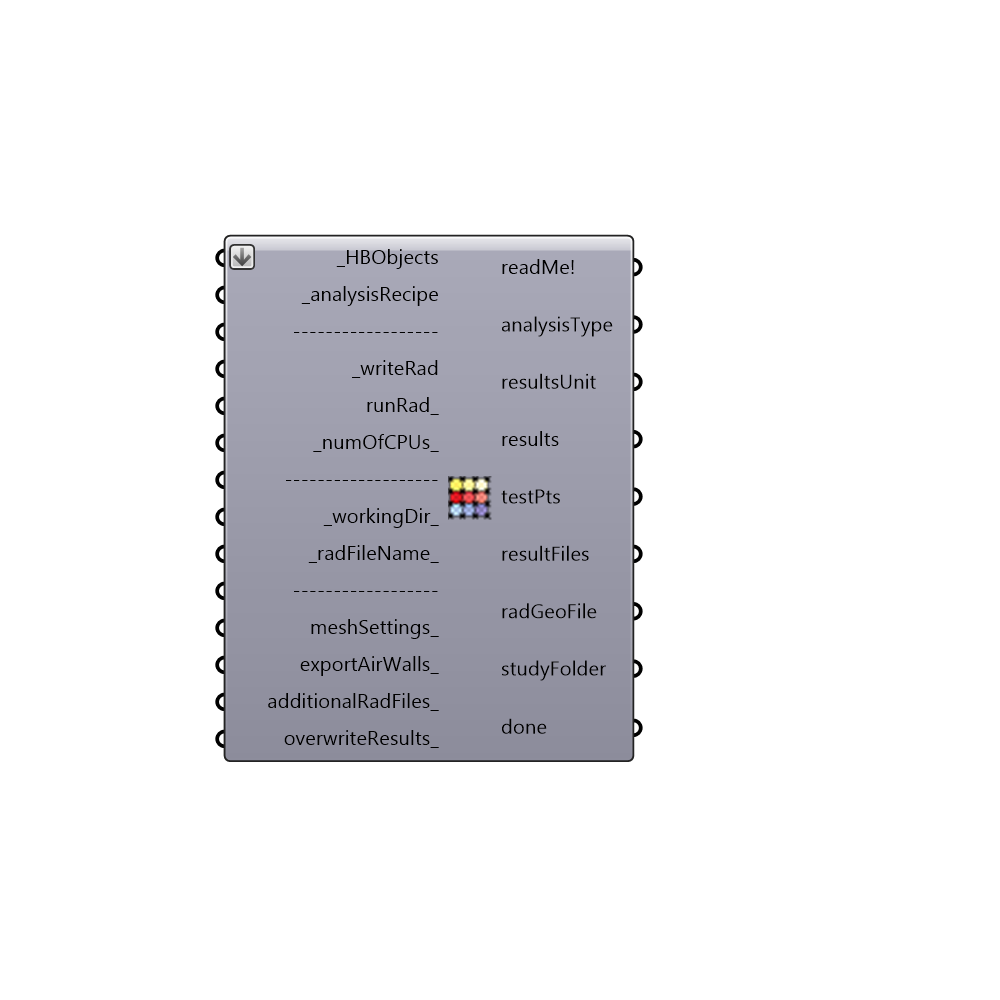

##  Run Daylight Simulation

export geometries to rad file, and run daylighting/energy simulation
 -
 

#### Inputs
* ##### HBObjects [Required]
List of Honeybee objects
* ##### analysisRecipe [Required]
An analysis recipe
* ##### writeRad [Required]
Write simulation files
* ##### runRad [Optional]
Run the analysis. _writeRad should be also set to true. Set to 2 if you want the analysis to run in background. This option is useful for parametric runs when you don't want to see command shells.
* ##### numOfCPUs [Default]
Number of CPUs to be used for the studies. This option doesn't work for image-based analysis
* ##### workingDir [Default]
Working directory on your system. Default is set to C:\Ladybug
* ##### radFileName [Default]
Input the project name as a string
* ##### meshSettings [Optional]
Custom mesh setting. Use Grasshopper mesh setting components
* ##### exportAirWalls [Optional]
Set to True if you want to export air walls as surfaces and False if you don't want air walls be exported.  The default is set to False.
* ##### additionalRadFiles [Optional]
A list of fullpath to valid radiance files which will be added to the scene
* ##### overwriteResults [Optional]
Set to False if you want the component create a copy of all the results. Default is True

#### Outputs
* ##### readMe!
...
* ##### analysisType
Type of the analysis (e.g. illuminance, luminance,...)
* ##### resultsUnit
Unit of the results (e.g. lux, candela, wh/m2)
* ##### results
Path to the results of grid based analysis (includes all the recipes except image-based and annual)
* ##### testPts
Test points
* ##### annual_analysis_files
Script variable runDaylightAnalysis
* ##### radGeoFile
Script variable runDaylightAnalysis
* ##### studyFolder
Script variable runDaylightAnalysis
* ##### done
True if the study is over

[Check Hydra Example Files for Run Daylight Simulation](https://hydrashare.github.io/hydra/index.html?keywords=Honeybee_Run Daylight Simulation)