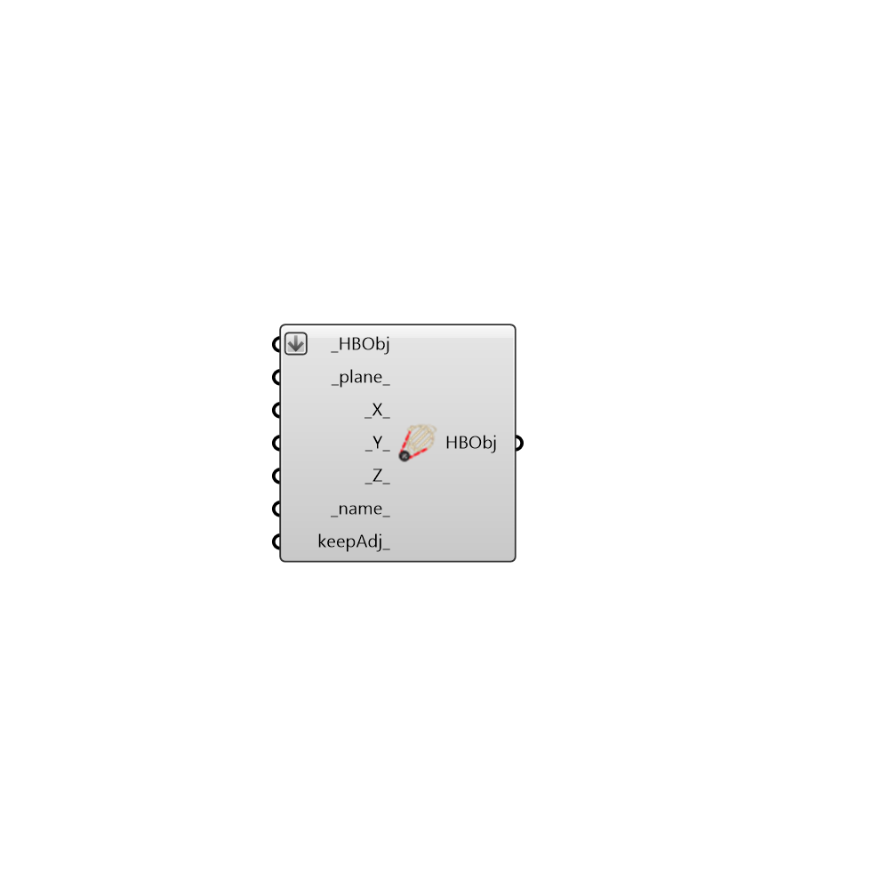

##  Scale Honeybee

Scale Honeybee Objects Non-Uniformly
 -
 

#### Inputs
* ##### HBObj [Required]
Honeybee surface or Honeybee zone
* ##### plane [Default]
Base Plane
* ##### X [Default]
Scaling factor in {x} direction
* ##### Y [Default]
Scaling factor in {y} direction
* ##### Z [Default]
Scaling factor in {z} direction

#### Outputs
* ##### HBObj
Transformed objects

[Check Hydra Example Files for Scale Honeybee](https://hydrashare.github.io/hydra/index.html?keywords=Honeybee_Scale Honeybee)