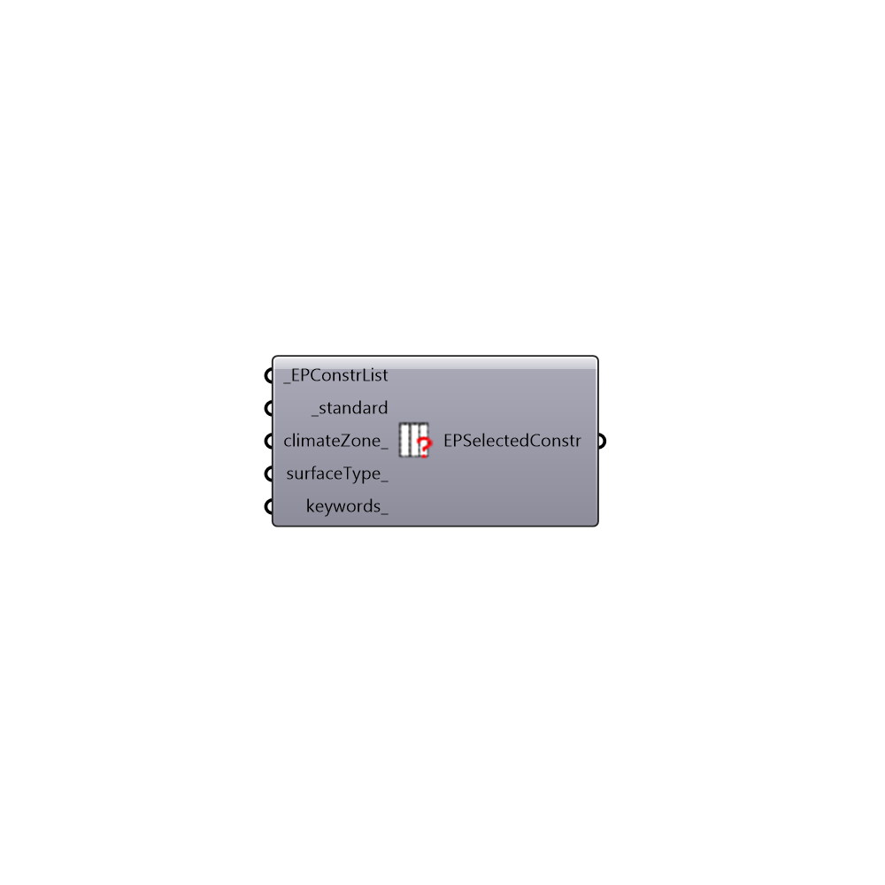

##  Search EP Construction - [[source code]](https://github.com/ladybug-tools/honeybee-legacy/tree/master/src/Honeybee_Search%20EP%20Construction.py)

Search EnergyPlus construction based on Energy modeling standards, climate zone, surface type and building program
 -
 

#### Inputs
* ##### EPConstrList [Required]
List of EPConstructions from Honeybee construction library
* ##### standard [Required]
Energy modeling standard [0:"ASHRAE 90.1-2004", 1:"ASHRAE 90.1-2007", 2:"ASHRAE 90.1-2010", 3:"ASHRAE 189.1", 4:"CBECS 1980-2004", 5:"CBECS Before-1980"]
* ##### climateZone [Optional]
Optional input for climate zone
* ##### surfaceType [Optional]
Optional input for surface type > 0:'WALL', 1:'ROOF', 2:'FLOOR', 3:'CEILING', 4:'WINDOW'
* ##### keywords [Optional]
Optional keyword in the name of the construction (ie. METAL, MASS, WOODFRAME).

#### Outputs
* ##### EPSelectedConstr
List of selected EP constructions that matches the the inputs

[Check Hydra Example Files for Search EP Construction](https://hydrashare.github.io/hydra/index.html?keywords=Honeybee_Search EP Construction)