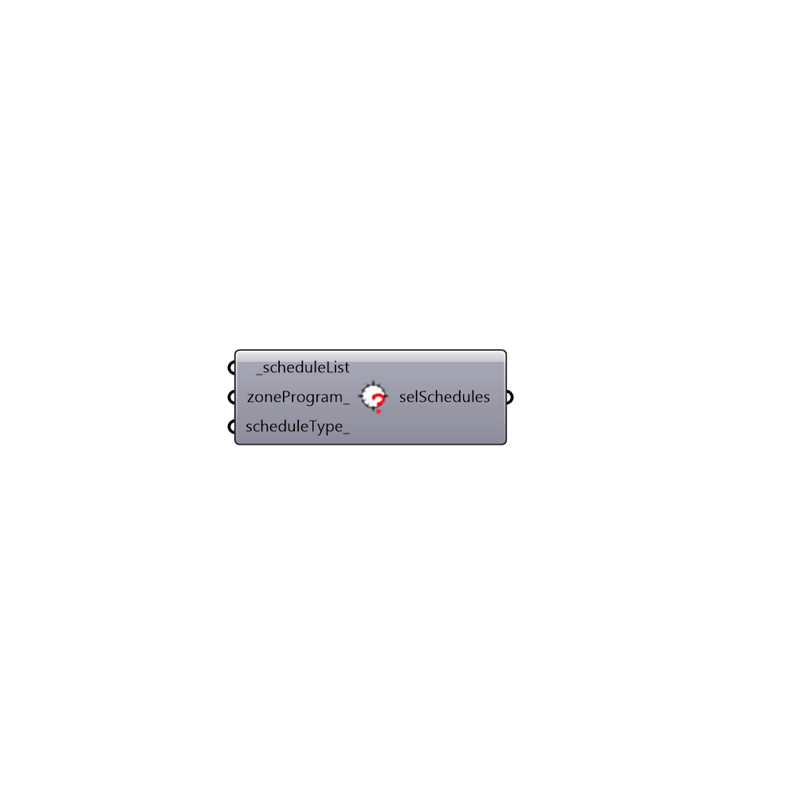

##  Search EP Schedule Library - [[source code]](https://github.com/ladybug-tools/honeybee-legacy/tree/master/src/Honeybee_Search%20EP%20Schedule%20Library.py)

Filter EP Schedule Library
 -
 

#### Inputs
* ##### scheduleList [Required]
Script input scheduleList.
* ##### zoneProgram [Optional]
Script input zoneProgram.
* ##### scheduleType [Optional]
Script input scheduleType.

#### Outputs
* ##### selSchedules
Script output selSchedule.

[Check Hydra Example Files for Search EP Schedule Library](https://hydrashare.github.io/hydra/index.html?keywords=Honeybee_Search EP Schedule Library)