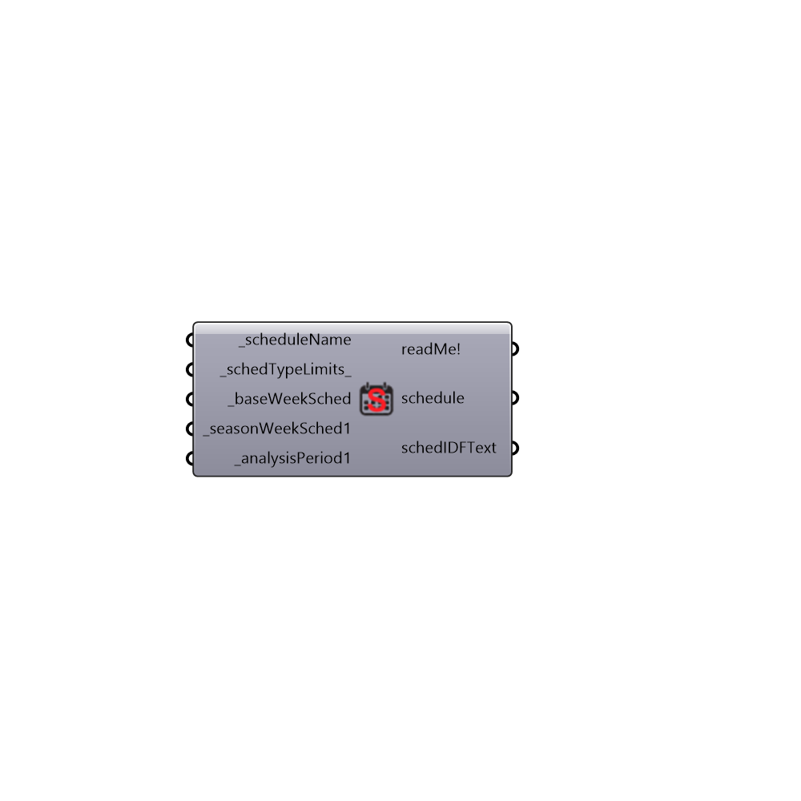

##  Seasonal Schedule - [[source code]](https://github.com/mostaphaRoudsari/honeybee/tree/master/src/Honeybee_Seasonal%20Schedule.py)

Use this component to generate a seasonal schedule (aka. a schedule composed of different weekly schedules).  Using the weekSched outputs of the other schedule generating components, you can combine these to create a yearly schedule that has different week schedules for different times of the year.
 -
 

#### Inputs
* ##### scheduleName [Required]
A name for the schedule that this component will create.  This name should be unique among the schedules in your Grasshopper document to ensure that you do not overwrite other schedules.
* ##### schedTypeLimits [Default]
A text string from the scheduleTypeLimits output of the 'Honeybee_Call From EP Schedule Library' component.  This value represents the units of the schedule input values.  The default is 'Fractional' for a schedule with values that range between 0 and 1.  Other common inputs include 'Temperature', 'On/Off', and 'ActivityLevel'.
* ##### baseWeekSched [Required]
A text string represeting the name of a weekly schedule to use for any parts of the year not specified in the analysisPeriods below.  Such weekly schedules are output from either the 'Honeybee_Constant Schedule' or the 'Honeybee_Annual Schedule' components.
* ##### seasonWeekSched1 [Required]
A text string represeting the name of a weekly schedule to use for analysisPeriod1 below.  Such weekly schedules are output from either the "Honeybee_Constant Schedule" or the "Honeybee_Annual Schedule" components.
* ##### analysisPeriod1 [Required]
An analysis period from the Ladybug_Analysis Period that specifies when the seasonWeekSched1_ above is active.

#### Outputs
* ##### readMe!
...
* ##### schedule
The name of the schedule that has been written to the memory of the GH document.  Connect this to any shcedule input of a Honeybee component to assign the schedule.
* ##### schedIDFText
The text needed to tell EnergyPlus how to run the schedule.  If you are done creating/editing a shcedule with this component, you may want to make your GH document smaller by internalizing this IDF text and using the "Honeybee_Add To EnergyPlus Library" component to add the schedule to the memory the next time you open the GH file.  Then you can delete this component.

[Check Hydra Example Files for Seasonal Schedule](https://hydrashare.github.io/hydra/index.html?keywords=Honeybee_Seasonal Schedule)