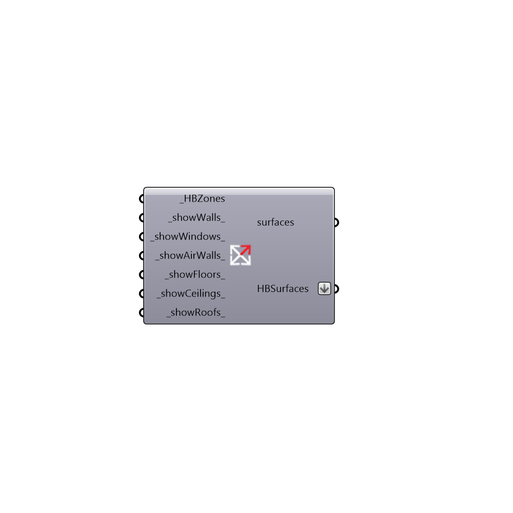

##  Select by Type - [[source code]](https://github.com/mostaphaRoudsari/honeybee/tree/master/src/Honeybee_Select%20by%20Type.py)

Select surfaces by type
 -
 

#### Inputs
* ##### HBZones [Required]
Honeybee Zones
* ##### showWalls [Default]
Set to true to output the walls
* ##### showWindows [Default]
Set to true to output the windows
* ##### showAirWalls [Default]
Set to true to output the air walls
* ##### showFloors [Default]
Set to true to output the floors
* ##### showCeilings [Default]
Script input showCeilings.
* ##### showRoofs [Default]
Set to true to output the roofs

#### Outputs
* ##### surfaces
Output surfaces as Grasshopper objects
* ##### HBSurfaces
The output surfaces as Honeybee surfaces

[Check Hydra Example Files for Select by Type](https://hydrashare.github.io/hydra/index.html?keywords=Honeybee_Select by Type)