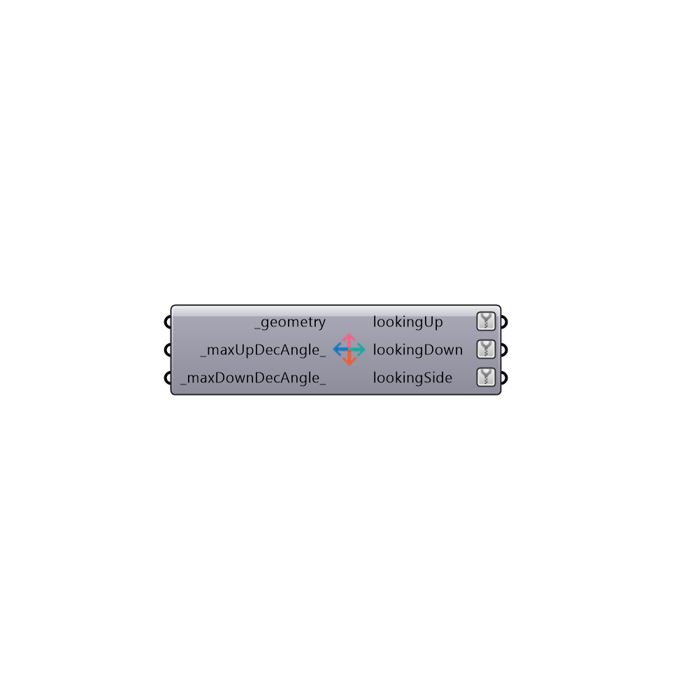

##  Separate By Normal - [[source code]](https://github.com/mostaphaRoudsari/honeybee/tree/master/src/Honeybee_Separate%20By%20Normal.py)

Separate surfaces by normal
 -
 

#### Inputs
* ##### geometry [Required]
Brep geometries
* ##### maxUpDecAngle [Default]
Maximum normal declination angle from ZAxis that should be still considerd up
* ##### maxDownDecAngle [Default]
Maximum normal declination angle from ZAxis that should be still considerd down

#### Outputs
* ##### lookingUp
List of surfaces which are looking upward
* ##### lookingDown
List of surfaces which are looking downward
* ##### lookingSide
List of surfaces which are looking to the sides

[Check Hydra Example Files for Separate By Normal](https://hydrashare.github.io/hydra/index.html?keywords=Honeybee_Separate By Normal)