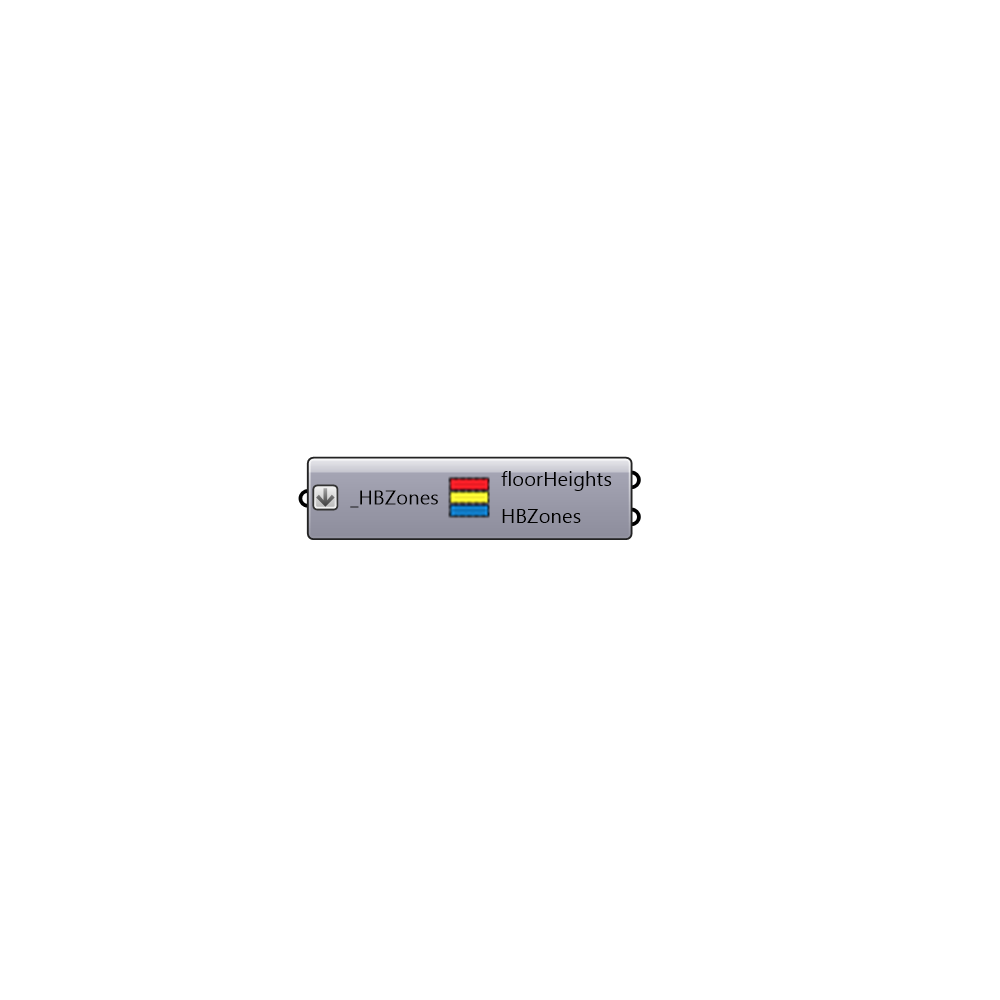

##  Separate Zones By Floor - [[source code]](https://github.com/ladybug-tools/honeybee-legacy/tree/master/src/Honeybee_Separate%20Zones%20By%20Floor.py)

Separate zones based on floor height
 -
 

#### Inputs
* ##### HBZones [Required]
List of HBZones

#### Outputs
* ##### floorHeights
List of floor heights
* ##### HBZones
Honeybee zones. Each branch represents a different floor

[Check Hydra Example Files for Separate Zones By Floor](https://hydrashare.github.io/hydra/index.html?keywords=Honeybee_Separate Zones By Floor)