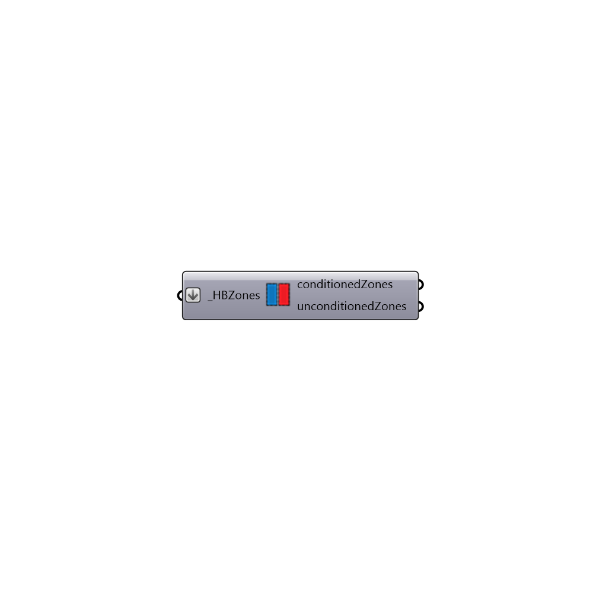

##  Separate conditioned and unconditioned zones

Separate zones into conditioned and unconditioned
 -
 

#### Inputs
* ##### HBZones [Required]
List of Honeybee zones

#### Outputs
* ##### conditionedZones
List of conditioned Honeybee zones
* ##### unconditionedZones
List of unconditioned Honeybee zones

[Check Hydra Example Files for Separate conditioned and unconditioned zones](https://hydrashare.github.io/hydra/index.html?keywords=Honeybee_Separate conditioned and unconditioned zones)