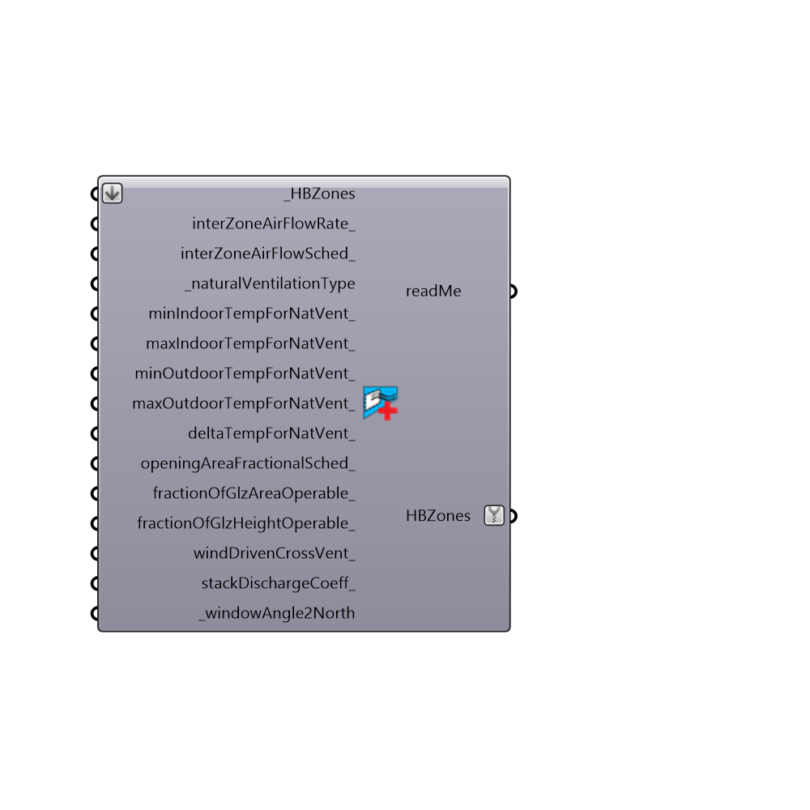

##  Set EP Air Flow - [[source code]](https://github.com/mostaphaRoudsari/honeybee/tree/master/src/Honeybee_Set%20EP%20Air%20Flow.py)

Use this component to edit the airflow between your zones's air walls and/or set natural ventilation.  The natural ventilation that this component models is mostly meant for single zones and cases where there is not much airflow between zones. Specifically, this component can model a few common types of natural ventilation:
     1 - Single-sided Ventilation - ventilation driven by the height difference across individual windows on a single side of a building.
     2 - Cross Ventilation - ventilation driven by the pressure difference across windows on two opposite sides of a building.
     3 - Chimney Ventilation - ventilation driven by a chimney/stack that is attached to a zone.
     4 - Cowl Ventilation - ventilation driven by wind through a cowl attached to a zone.
     5 - Fan-driven Ventilation - ventilation at a constant flow rate driven by a fan.
 _
 The component can model "multi-zone" natural ventilation so long as there are no major vertical differences in height over multiple zones and the user understands that "mixing objects" of constant air flow are used to dsitribute incoming air between zones that are connected by an air wall.  As such, this method is not meant to model atriums or any method relying on inter-zone buoyancy-driven flow.
 _
 Natural ventilation (that i nt fan-driven) is computed using the following formulas:
 Ventilation Wind = Wind Coefficient * Opening Area * Schedule * WindSpd 
 Ventilation Stack = Stack Discharge Coefficient * Opening Area * Schedule * SQRT(2 * Gravity * Operable Height * (|(Temp Zone - Temp Outdoors)| / Temp Zone)) 
 Total Ventilation = SQRT((Ventilation Wind)^2 + (Ventilation Stack)^2)
 -
 

#### Inputs
* ##### HBZones [Required]
The HBZones out of any of the HB components that generate or alter zones.
* ##### interZoneAirFlowRate [Optional]
An optional number that represents airflow in m3/s per square meter of air wall contatct surface area between zones.  By default, this value is set to 0.0963 m3/s for each square meter of air wall contact surface area, which is a decent assumption for conditions of relatively low indoor air velocity.  In cases of higher indoor air velocity, such as those that might occur with consistent wind-driven ventilation or ventilation with fans, you will likely want to increase this number. This can be either a single number to be applied to all connected zones or a list of numbers for each different zone.
* ##### interZoneAirFlowSched [Optional]
An optional schedule of fractional values to set when the air flows in between zones.
* ##### naturalVentilationType [Required]
Choose from the following options:      0 - NO NATURAL VENTILATION - Choose this option if you do not want to add any natrual ventilation objects to your zones with this component.      1 - WINDOW NATURAL VENTILATION - Choose this to have the component automatically calculate natural ventilation airflow based on ALL of your zone's exterior windows, a specified fraction of operable glazing, and a specified fraction of the glazing height that is operable.  It will be assumed that each window has a single opening, that this window opening is sliding, and that the difference in the heights between the different windows is not great enough to induce bouyancy driven flow from one window to another. The default assumes an opening that extends the full window height with half of the total glazing area operable (a horizontal sliding window).  The default also assumes the presence of insect screens (discharge doefficient of 0.17).  Finally, the default negates wind-driven cross ventilation but this option should be set to True if there is roughly equal opeerable area on both sides of the zone or there is some other (non-window) opening in the zone.      2 - CUSTOM STACK / WIND VENTILATION - Choose this option if you have window ventilation that does not fit the description above or if you are trying to model an object like a chimney or a cowl.  You will have to specify an effective window area for the object and the height between inlet and outlet. Note that you can eliminate either the wind or the stack part of the equation by setting the respective discharge coefficent to 0.      3 - FAN-DRIVEN VENTILATION - Choose this option to have your zones ventilated at a constant volume flow rate, representing fan-driven ventilation.  You will have to specify the design flow rate in m3/s.  You can also change the default fan efficiency, which will affect the electic consumption of the fan in the output.
* ##### minIndoorTempForNatVent [Optional]
A number or list of numbers between -100 and 100 that represents the minimum indoor temperature at which to naturally ventilate.  This can be either a single number to be applied to all connected zones or a list of numbers for each different zone.
* ##### maxIndoorTempForNatVent [Optional]
A number or list of numbers between -100 and 100 that represents the maximum indoor temperature at which to naturally ventilate.  Use this to design mixed-mode buildings where you would like occupants to shut the windows and turn on a cooling system if it gets too hot inside.  This can be either a single number to be applied to all connected zones or a list of numbers for each different zone.
* ##### minOutdoorTempForNatVent [Optional]
A number or list of numbers between -100 and 100 that represents the minimum outdoor temperature at which to naturally ventilate.  This can be either a single number to be applied to all connected zones or a list of numbers for each different zone.
* ##### maxOutdoorTempForNatVent [Optional]
A number or list of numbers between -100 and 100 that represents the minimum outdoor temperature at which to naturally ventilate.  Use this to design night flushed buildings where windows are closed for daytime temperatures and opened at night or a mixed-mode buildings where you would like occupants to shut the windows and turn on a cooling system if it gets too hot outside. This can be either a single number to be applied to all connected zones or a list of numbers for each different zone.
* ##### deltaTempForNatVent [Optional]
A number or list of numbers between -100 and 100 that represents the temperature differential between indoor and outdoor below which ventilation is shutoff.  This should usually be a negative number so that you open the windows when the outdoors is cooler than the indoors. This can be either a single number to be applied to all connected zones or a list of numbers for each different zone.
* ##### openingAreaFractionalSched [Optional]
An optional schedule to set the fraction of the window that is open at each hour.
* ##### fractionOfGlzAreaOperable [Optional]
A number or list of numbers between 0.0 and 1.0 that represents the fraction of the window area that is operable.  By default, it will be assumed that this is 0.5 assuming sliding windows that slide horizontally.
* ##### fractionOfGlzHeightOperable [Optional]
A number or list of numbers between 0.0 and 1.0 that represents the fraction of the distance from the bottom of the zones windows to the top that are operable.  By default, it will be assumed that this is 1.0 assuming sliding windows that slide horizontally.
* ##### windDrivenCrossVent [Optional]
Set to 'True' if there is operable area of roughly equal area on different sides of the zone such that wind-driven cross ventilation will be induced.  Set to 'False' if the operable area is primarily on one side of the zone and there is no wind-driven ventilation.  The default will examine the difference in directions that the zone's windows are facing and, if this maximum difference is greater than 90 degrees, cross ventilation will be turned on.  This input overrides this default.
* ##### stackDischargeCoeff [Optional]
A number between 0.0 and 1.0 that will be multipled by the area of the window to account for additional friction from window geometry, insect screens, etc.  This is the 'Stack Discharge Coefficient' variable in the equation of this component's description.  If left blank, this variable will be assumed to be 0.17 for single-sided ventilation with sliding windows and insect screens.  This value should be changed if windows are awning or casement. Some common values for this coefficient include the following:      0.0 - Completely discounts stack ventilation from the natural ventilation calculation.      0.17 - For buoyancy with ONE opening WITH an insect screen. In this case, the effective area should be the whole opening.      0.25 - For buoyancy with ONE opening with NO insect screen. In this case, the effective area should be the whole opening.      0.45 - For buoyancy with TWO openings of different heights, each of which HAVE insect screens. In this case, the effective area should be just the area of ONE of the two window openings (if opening areas are equal).      0.65 - For buoyancy with TWO openings of different heights, each of which have NO insect screens.  In this case, the effective area should be just the area of ONE of the two window openings (if opening areas are equal).
* ##### windowAngle2North [Required]
A number between 0 and 360 that sets the angle in degrees from North counting clockwise to the direction the window faces.  An angle of 0 denotes that the opening faces North, 90 denotes East, 180 denotes South, and 270 denotes West.

#### Outputs
* ##### readMe
...
* ##### HBZones
HBZones with their airflow modified.

[Check Hydra Example Files for Set EP Air Flow](https://hydrashare.github.io/hydra/index.html?keywords=Honeybee_Set EP Air Flow)