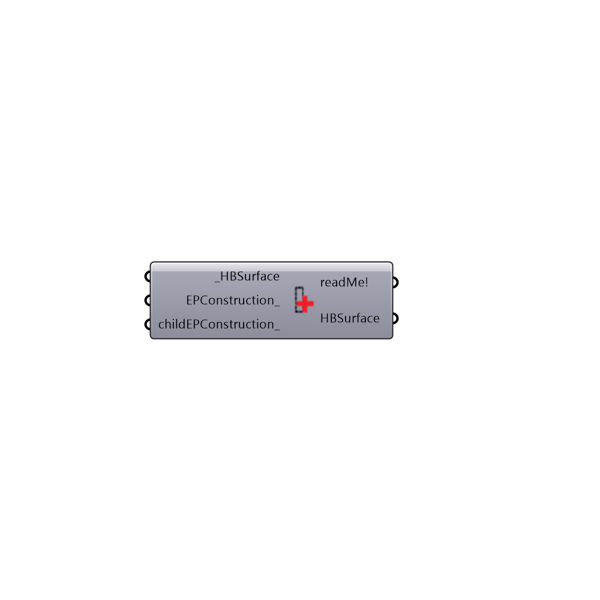

##  Set EP Surface Construction - [[source code]](https://github.com/ladybug-tools/honeybee-legacy/tree/master/src/Honeybee_Set%20EP%20Surface%20Construction.py)

Add Glazing
 -
 

#### Inputs
* ##### HBSurface [Required]
A HBSurface
* ##### EPConstruction [Optional]
Optional EnergyPlus construction
* ##### childEPConstruction [Optional]
Optional EnergyPlus construction for child surface

#### Outputs
* ##### readMe!
...
* ##### HBSurface
Modified Honeybee surface

[Check Hydra Example Files for Set EP Surface Construction](https://hydrashare.github.io/hydra/index.html?keywords=Honeybee_Set EP Surface Construction)