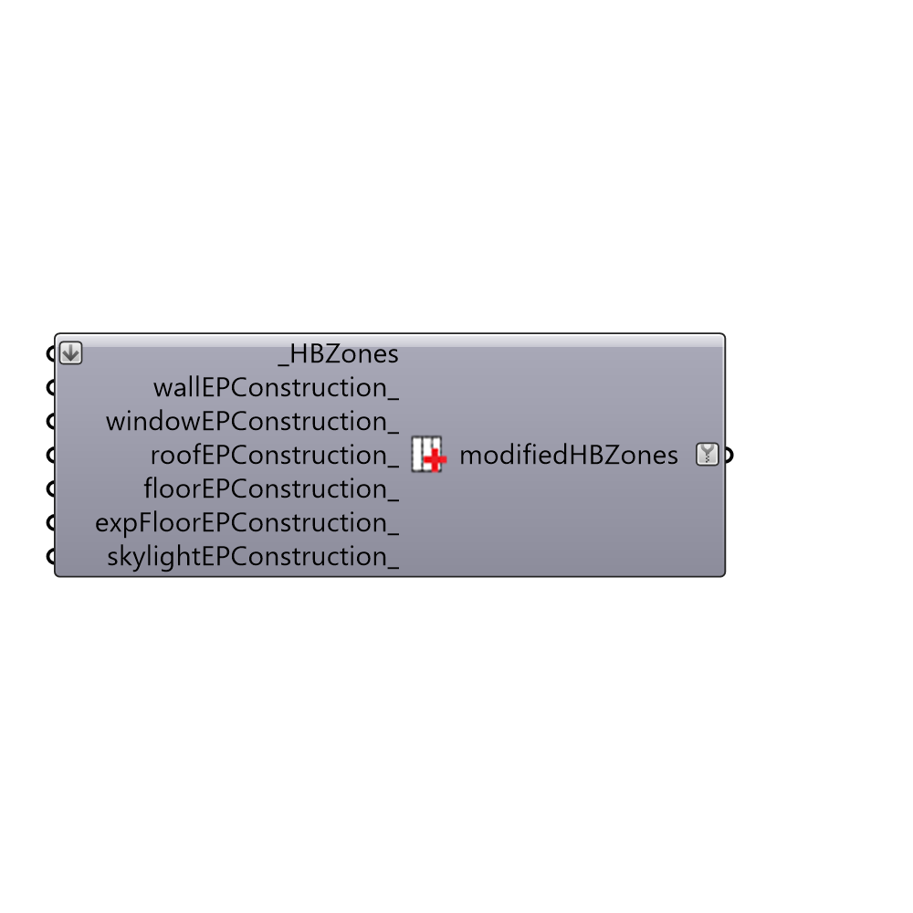

##  Set EP Zone Construction

Update EP construction of zone based on type
 -
 

#### Inputs
* ##### HBZones [Required]
Honeybee zones
* ##### wallEPConstruction [Optional]
Optional new construction for walls
* ##### windowEPConstruction [Optional]
Optional new construction for windows
* ##### roofEPConstruction [Optional]
Optional new construction for roofs
* ##### floorEPConstruction [Optional]
Optional new construction for floors
* ##### expFloorEPConstruction [Optional]
Optional new construction for exposed floors
* ##### skylightEPConstruction [Optional]
Optional new construction for skylights

#### Outputs
* ##### modifiedHBZones
Honeybee zone with updated constructions

[Check Hydra Example Files for Set EP Zone Construction](https://hydrashare.github.io/hydra/index.html?keywords=Honeybee_Set EP Zone Construction)