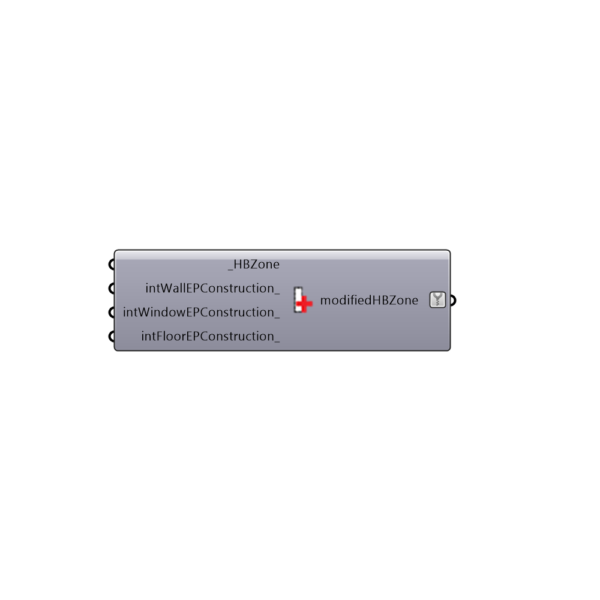

##  Set EP Zone Interior Construction - [[source code]](https://github.com/mostaphaRoudsari/honeybee/tree/master/src/Honeybee_Set%20EP%20Zone%20Interior%20Construction.py)

Set EP Zones Interior Construction
 -
 

#### Inputs
* ##### HBZones [Required]
Honeybee zones
* ##### intWallEPConstruction [Optional]
Optional new construction for interior walls
* ##### intWindowEPConstruction [Optional]
Optional new construction for interior windows 
* ##### intFloorEPConstruction [Optional]
Optional new construction for interior floors
* ##### intCeilingEPConstruction [Optional]
Optional new construction for interior ceilings.  If no value is connected here but a value is connected for interior floors, the intCeiling construction will be assumed to be the same as the intFloor construction above.

#### Outputs
* ##### modifiedHBZones
Honeybee zone with updated constructions

[Check Hydra Example Files for Set EP Zone Interior Construction](https://hydrashare.github.io/hydra/index.html?keywords=Honeybee_Set EP Zone Interior Construction)