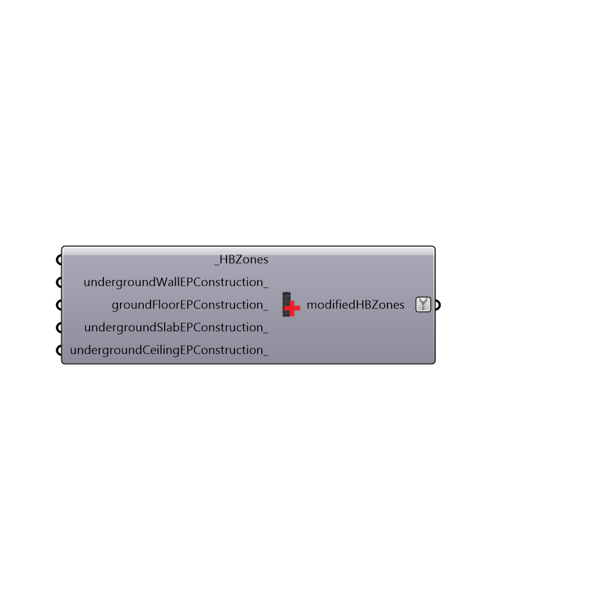

##  Set EP Zone Underground Construction

Update EP construction of zone based on type
 -
 

#### Inputs
* ##### HBZones [Required]
Honeybee zone
* ##### undergroundWallEPConstruction [Optional]
Optional new construction for underground walls
* ##### groundFloorEPConstruction [Optional]
Optional new construction for ground floors
* ##### undergroundSlabEPConstruction [Optional]
Optional new construction for underground slabs
* ##### undergroundCeilingEPConstruction [Optional]
Optional new construction for underground ceilings

#### Outputs
* ##### modifiedHBZones
Honeybee zone with updated constructions

[Check Hydra Example Files for Set EP Zone Underground Construction](https://hydrashare.github.io/hydra/index.html?keywords=Honeybee_Set EP Zone Underground Construction)