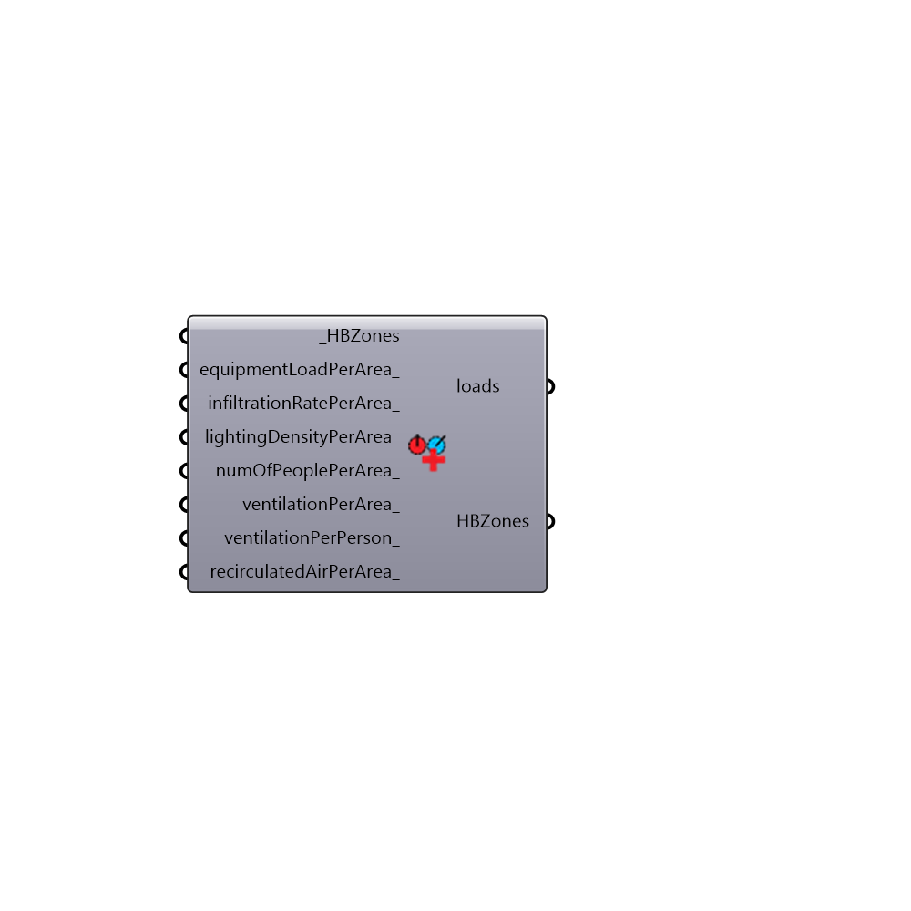

##  Set EnergyPlus Zone Loads

Use this component to change the occupancy, lighting, equipment, etc. loads for a given Honeybee zone or list of Honeybee zones.
 -
 

#### Inputs
* ##### HBZones [Required]
Honeybee zones for which you want to change the loads.
* ##### equipmentLoadPerArea [Optional]
The desired equipment load per square meter of floor.  Values here should be in W/m2 (Watts per square meter).  Typical values can range from 2 W/m2 (for just a laptop or two in the zone) to 15 W/m2 for an office filled with computers and appliances.
* ##### infiltrationRatePerArea [Optional]
The desired rate of outside air infiltration into the zone per square meter of floor.  Values here should be in m3/s-m2 (Cubic meters per second per square meter of floor).  Typical values tend to be around 0.0002 m3/s-m2 for tightly sealed buildings but you can make this much higher if you want to simulate a lot of air entering the zone for ventilation. 
* ##### lightingDensityPerArea [Optional]
The desired lighting load per square meter of floor.  Values here should be in W/m2 (Watts per square meter).  Typical values can range from 3 W/m2 for efficeint LED bulbs to 15 W/m2 for incandescent heat lamps.
* ##### numOfPeoplePerArea [Optional]
The desired number of per square meter of floor at peak occupancy.  Values here should be in ppl/m2 (People per square meter).  Typical values can range from 0.02 ppl/m2 for a lightly-occupied household to 0.5 ppl/m2 for a tightly packed auditorium.
* ##### ventilationPerArea [Optional]
The desired minimum rate of outdoor air ventilation through the mechanical system into the zone in m3/s per m2 of floor.  Values here should be in m3/s-m2 (Cubic meters per second per square meter of floor).  Often, this total value over the zone should be much lower than the ventilation per person (below).  Typical values can range from 0.0002 m3/s-m2 for lightly-occupied houses to 0.0025 m3/s-m2 for spaces like laboratories and cleanrooms where dust contamination is a major concern.
* ##### ventilationPerPerson [Optional]
The desired minimum rate of outdoor air ventilation through the mechanical system into the zone per person in the zone.  Values here should be in m3/s-person (Liters per second per person in the zone). In effect, an input here will mimic demand controlled ventilation, where the ventilation through the mechanical system will change depending upon the occupancy. Most standards suggest that you should have at least 0.001 m3/s for each person in the zone but this may be increased sometimes to avoid odors or exposure to indoor pollutants.
* ##### recirculatedAirPerArea [Optional]
The desired minimum rate of recirculated air flow through the HVAC system in m3/s per m2 of floor.  Note that this input does not affect any models run with ideal air systems and only has an effect on OpenStudio models where recirculated air is required in addtion to outdoor ventilation (such as hostpital patient rooms that require additional ventilation to limit the spread of diseases).  The defult is always set to zero as most spaces do not require recirculated air.

#### Outputs
* ##### loads
The current loads of the HBZones.
* ##### HBZones
Honeybee zones with modifided loads.

[Check Hydra Example Files for Set EnergyPlus Zone Loads](https://hydrashare.github.io/hydra/index.html?keywords=Honeybee_Set EnergyPlus Zone Loads)