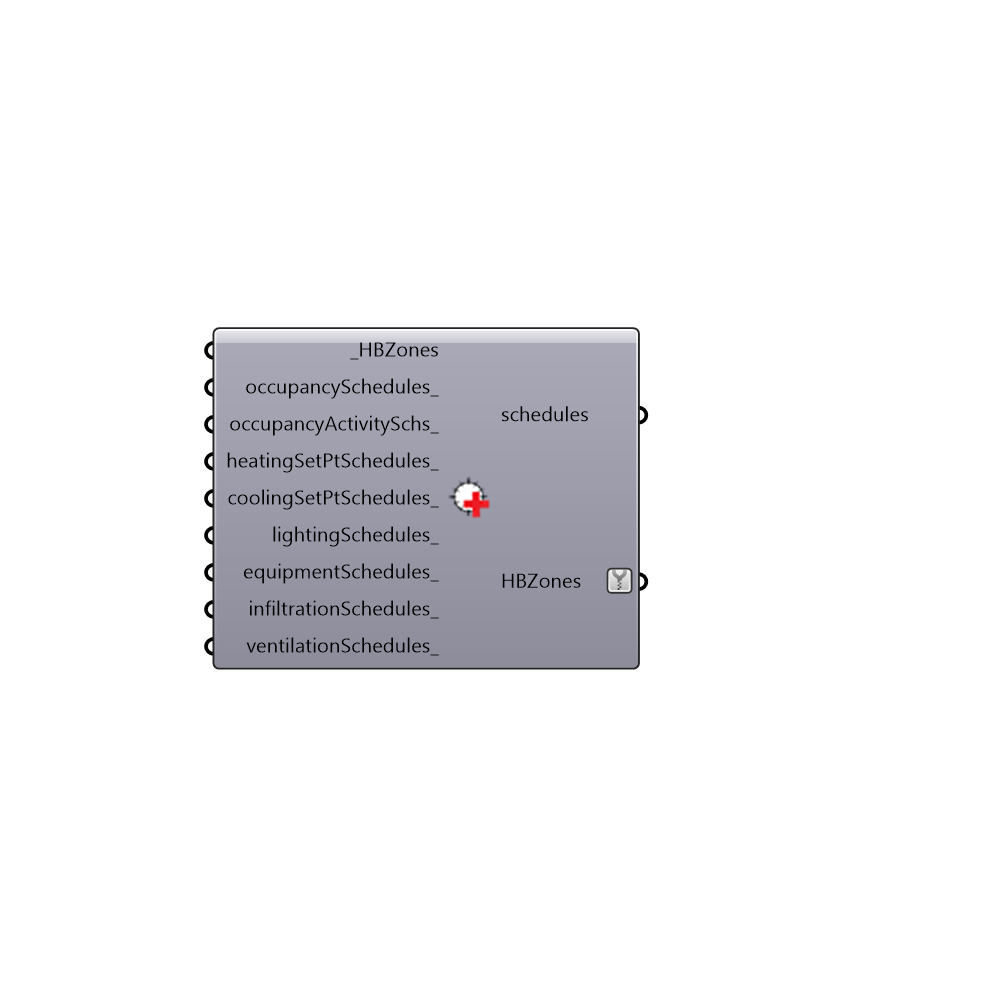

##  Set EnergyPlus Zone Schedules

Use this component to change the schedules of your HBZones.
 -
 

#### Inputs
* ##### HBZones [Required]
HBZones for which you want to change shcedules.
* ##### occupancySchedules [Optional]
A text string representing the occupancy shceudle that you want to use.  This can be either a shcedule from the "Honeybee_Call from EP Schedule Library" component, a schedule from the "Honeybee_Annual Schedule" component, or a CSV schedule from the "Honeybee_Create CSV Schedule" component.
* ##### occupancyActivitySchs [Optional]
A text string representing the shceudle for the metabolic rate of the occupants that you want to use.  This can be either a shcedule from the "Honeybee_Call from EP Schedule Library" component, a schedule from the "Honeybee_Annual Schedule" component, or a CSV schedule from the "Honeybee_Create CSV Schedule" component. If this is a custon schedule, the values in it should be Watts and the "units_" or "_schedTypeLimits_" input should be "ActivityLevel."
* ##### heatingSetPtSchedules [Optional]
A text string representing the heating setpoint shceudle that you want to use.  This can be either a shcedule from the "Honeybee_Call from EP Schedule Library" component, a schedule from the "Honeybee_Annual Schedule" component, or a CSV schedule from the "Honeybee_Create CSV Schedule" component.  If this is a custon schedule, the values in it should be Watts and the "units_" or "_schedTypeLimits_" input should be "Temperature."
* ##### coolingSetPtSchedules [Optional]
A text string representing the cooling setpoint shceudle that you want to use.  This can be either a shcedule from the "Honeybee_Call from EP Schedule Library" component, a schedule from the "Honeybee_Annual Schedule" component, or a CSV schedule from the "Honeybee_Create CSV Schedule" component.  If this is a custon schedule, the values in it should be Watts and the "units_" or "_schedTypeLimits_" input should be "Temperature."
* ##### lightingSchedules [Optional]
...
* ##### equipmentSchedules [Optional]
A text string representing the equipment shceudle that you want to use.  This can be either a shcedule from the "Honeybee_Call from EP Schedule Library" component, a schedule from the "Honeybee_Annual Schedule" component, or a CSV schedule from the "Honeybee_Create CSV Schedule" component.
* ##### infiltrationSchedules [Optional]
A text string representing the infiltration shceudle that you want to use.  This can be either a shcedule from the "Honeybee_Call from EP Schedule Library" component, a schedule from the "Honeybee_Annual Schedule" component, or a CSV schedule from the "Honeybee_Create CSV Schedule" component.
* ##### ventilationSchedules [Optional]
A text string representing the ventilation shceudle that you want to use.  Note that this schedule overrides the typical ventilation that occurs based on the occupancy shcedule and the "ventilationPerPerson."  The ventilation will be hard-sized based on this schedule and the maximum combined flowrates of "ventilationPerPerson" and "ventilationPerarea."  This can be either a shcedule from the "Honeybee_Call from EP Schedule Library" component, a schedule from the "Honeybee_Annual Schedule" component, or a CSV schedule from the "Honeybee_Create CSV Schedule" component.

#### Outputs
* ##### schedules
A report of what shcedules are assigned to each zone.
* ##### HBZones
HBZones that have had thier shcedules modified.

[Check Hydra Example Files for Set EnergyPlus Zone Schedules](https://hydrashare.github.io/hydra/index.html?keywords=Honeybee_Set EnergyPlus Zone Schedules)