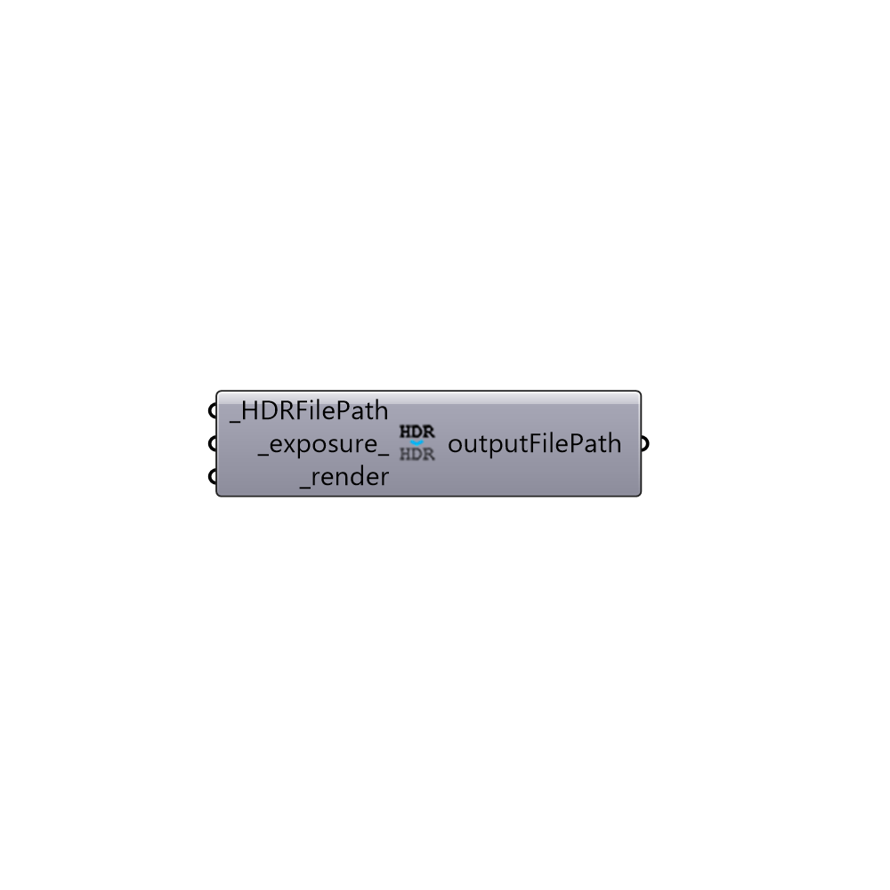

##  Set Exposure for HDR - [[source code]](https://github.com/mostaphaRoudsari/honeybee/tree/master/src/Honeybee_Set%20Exposure%20for%20HDR.py)

Set Exposure for HDR
 -
 

#### Inputs
* ##### HDRFilePath [Required]
Path to an HDR image file
* ##### exposure [Default]
A number between 0 and 1
* ##### render [Required]
Set to True to render the new image

#### Outputs
* ##### outputFilePath
Path to the result HDR file

[Check Hydra Example Files for Set Exposure for HDR](https://hydrashare.github.io/hydra/index.html?keywords=Honeybee_Set Exposure for HDR)