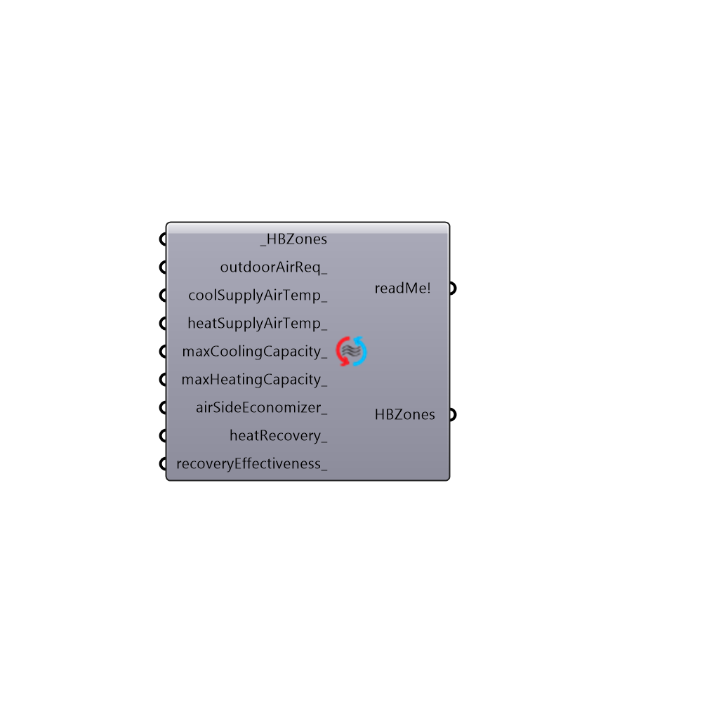

##  Set Ideal Air Loads Parameters

Use this component to change aspects of the ideal air system used in the "Honeybee_Run Energy Simulation" component.  The includes the temperature of the heating/cooling supply air, the maximum capacity of the system, demand controlled ventilation, air-side economizers, and heat recovery.
 -
 

#### Inputs
* ##### HBZones [Required]
HBZones for which parameters of the ideal air system should be changed.
* ##### outdoorAirReq [Optional]
An integer or text string value that changes the outdoor air requirement of the zone (the default is set to "0 - Sum").  Choose from the following options:
 0 - Sum - The outdoor air coming through the mechnical system will be the sum of the specified flow/m2 of zone floor area and the flow/person.  This is the default and is the usual recommendation of ASHRAE
 1 - Maximum - The outdoor air coming through the mechnical system will be either the specified flow/m2 of zone floor area or the flow/person (depending on which is larger at a given hour).   Choosing this option effectively implies that there is a demand-controlled ventilation system set up in the zone.
 2 - None - No outdoor air will come through the mechanical system and the heating/cooling will be applied only through re-circulation of indoor air.  Be careful as this option might not bring enough fresh air to occupants if the zone's infiltration is very low.
* ##### coolSupplyAirTemp [Optional]
A number or list of numbers that represent the temperature of the air used to cool the zone in degrees Celcius.  If no value is input here, the system will use air at 13 C.  This input can be either a single number to be applied to all connected zones or a list of numbers for each different zone.
* ##### heatSupplyAirTemp [Optional]
A number or list of numbers that represent the temperature of the air used to heat the zone in degrees Celcius.  If no value is input here, the system will use air at 50 C.  This input can be either a single number to be applied to all connected zones or a list of numbers for each different zone.
* ##### maxCoolingCapacity [Optional]
A number or list of numbers that represent the maximum cooling power that the system can deliver in kiloWatts.  If no value is input here, the system will have no limit to its cooling capacity.  This input can be either a single number to be applied to all connected zones or a list of numbers for each different zone.
* ##### maxHeatingCapacity [Optional]
A number or list of numbers that represent the maximum heating power that the system can deliver in kiloWatts.  If no value is input here, the system will have no limit to its heating capacity.  This input can be either a single number to be applied to all connected zones or a list of numbers for each different zone.
* ##### airSideEconomizer [Optional]
Set to "True" to have the ideal air system include an air side economizer.  This essentially means that the HVAC system will increase the outdoor air flow rate when there is a cooling load and the outdoor air temperature is below the temperature of the exhaust air.  If this input is set to "False", the HVAC system will constantly provide the same amount of outdoor air and will run the compressor to remove heat. This may result in cases where there is a lot of cooling energy in winter or unexpected parts of the year.  This input can be either a single boolean value to be applied to all connected zones or a list of boolean values for each different zone. The defailt is set to "True" to include an air side economizer.
* ##### heatRecovery [Optional]
Set to "True" to have the ideal air system include a heat recovery system.  This essentially means that the HVAC system will pass the outlet air through a heat exchanger with the inlet air before exhausting it, helping recover heat that would normally be lost through the exhaust.  If this input is set to "False" or left untouched, the HVAC system will simply exhaust air without having it interact with incoming air. This input can be either a single boolean value to be applied to all connected zones or a list of boolean values for each different zone.
* ##### recoveryEffectiveness [Optional]
If the above input has been set to "True", input a number between 0 and 1 here to set the fraction of heat that is recovered by the heat recovery system.  By default, this value is 0.7.

#### Outputs
* ##### readMe!
The execution information, as output and error streams
* ##### HBZones
HBZones with altered ideal air loads systems.

[Check Hydra Example Files for Set Ideal Air Loads Parameters](https://hydrashare.github.io/hydra/index.html?keywords=Honeybee_Set Ideal Air Loads Parameters)