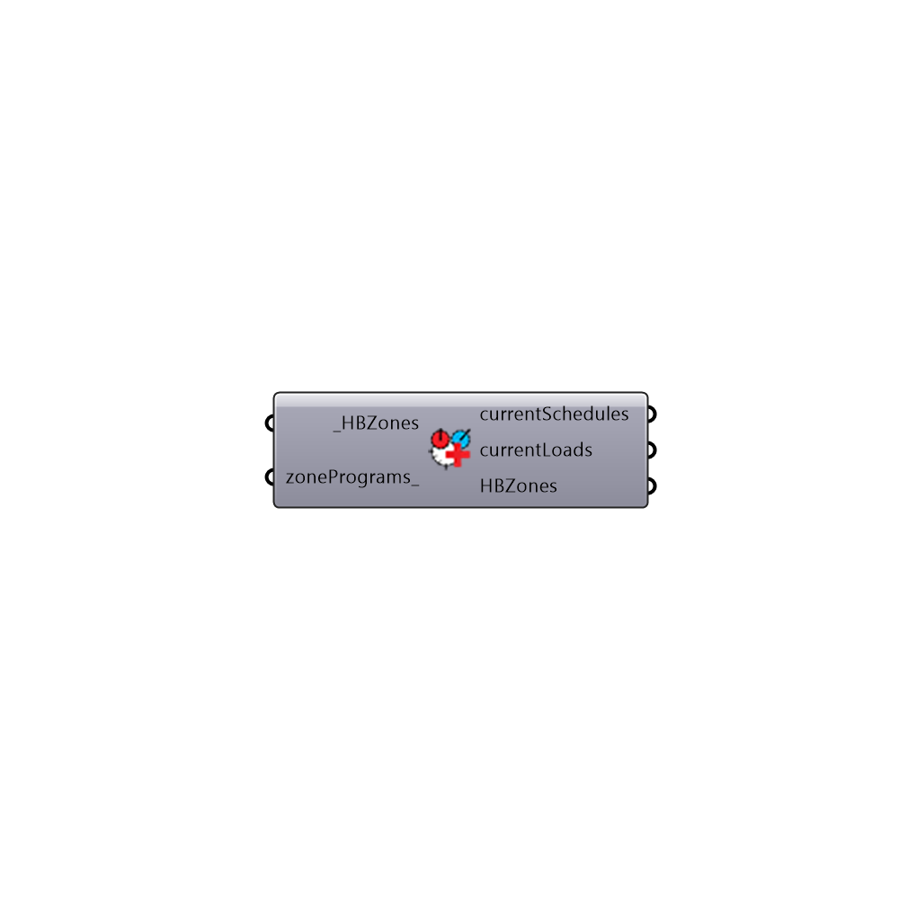

##  Set Loads And Schedules

Set schedules and loads for zones based on program 
 -
 

#### Inputs
* ##### HBZones [Required]
...
* ##### zonePrograms [Optional]
...

#### Outputs
* ##### currentSchedules
...
* ##### currentLoads
...
* ##### HBZones
...

[Check Hydra Example Files for Set Loads And Schedules](https://hydrashare.github.io/hydra/index.html?keywords=Honeybee_Set Loads And Schedules)