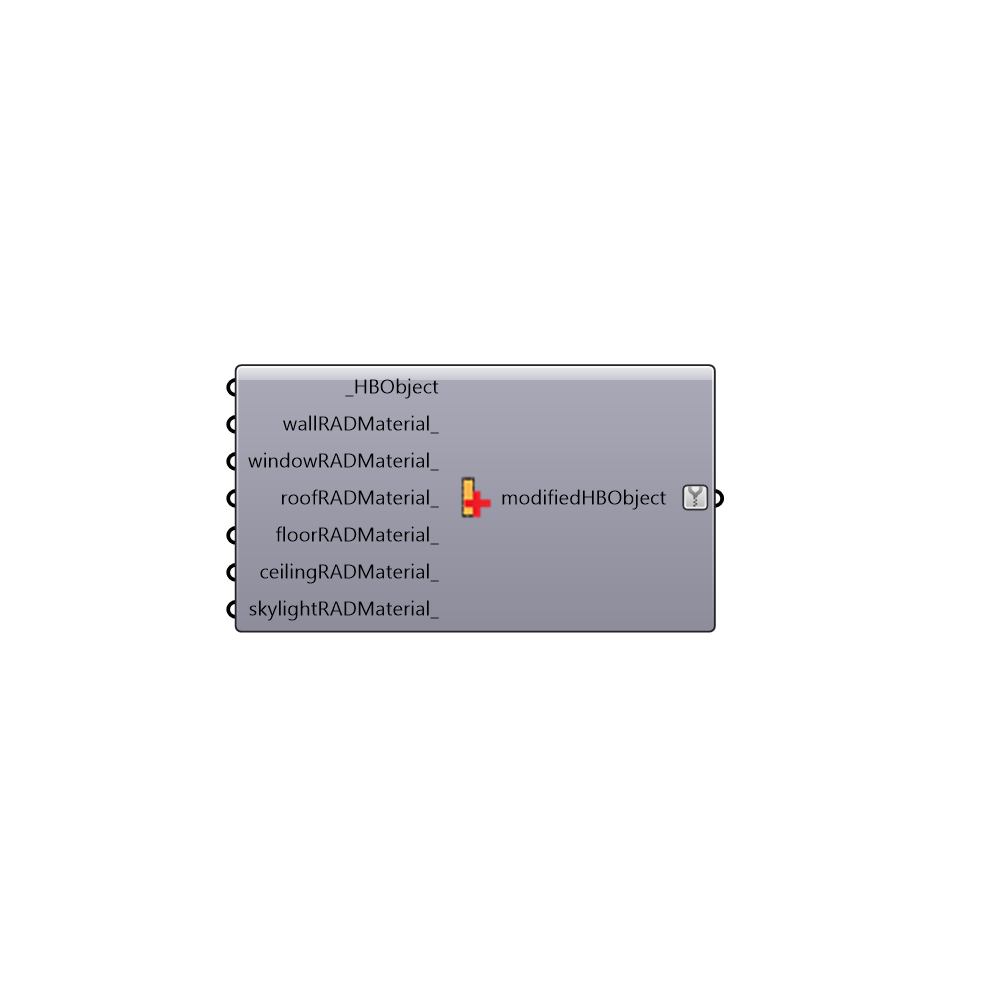

##  Set Radiance Materials - [[source code]](https://github.com/ladybug-tools/honeybee-legacy/tree/master/src/Honeybee_Set%20Radiance%20Materials.py)

Radiance Default Materials
 -
 

#### Inputs
* ##### HBObject [Required]
List of Honeybee zones or surfaces
* ##### wallRADMaterial [Optional]
Optional wall material to overwrite the default walls
* ##### windowRADMaterial [Optional]
Optional material for windows
* ##### roofRADMaterial [Optional]
Optional material for roofs
* ##### floorRADMaterial [Optional]
Optional material for floors
* ##### ceilingRADMaterial [Optional]
Optional material for ceilings
* ##### skylightRADMaterial [Optional]
Optional material for skylights

#### Outputs
* ##### modifiedHBObject
Honeybee object with updated materials

[Check Hydra Example Files for Set Radiance Materials](https://hydrashare.github.io/hydra/index.html?keywords=Honeybee_Set Radiance Materials)