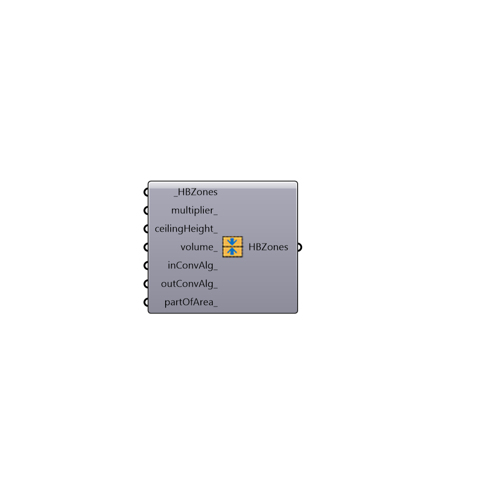

##  Set Zone Properties - [[source code]](https://github.com/mostaphaRoudsari/honeybee/tree/master/src/Honeybee_Set%20Zone%20Properties.py)

Use this component to set HBZone properties
 By default these values will be automatically calculated by EnergyPlus.
 -
 

#### Inputs
* ##### HBZones [Required]
Input HBZones.
* ##### multiplier [Optional]
A list of zone multipliers for each zone.
* ##### ceilingHeight [Optional]
A list of ceilings height for each zone.
* ##### volume [Optional]
A list of zone volumes for each zone.
* ##### inConvAlg [Optional]
A list of Inside Surface Convection Algorithm for each zone.
 Simple, TARP, CeilingDiffuser, AdaptiveConvectionAlgorithm, TrombeWall.
* ##### outConvAlg [Optional]
A list of Outside Surface Convection Algorithm for each zone.
 Simple, TARP, CeilingDiffuser, AdaptiveConvectionAlgorithm, TrombeWall.
* ##### partOfArea [Optional]
A list of Boolean for each zone. By default Zone area will
 be included in total floor area.

#### Outputs
* ##### HBZones
Modified HBZones.

[Check Hydra Example Files for Set Zone Properties](https://hydrashare.github.io/hydra/index.html?keywords=Honeybee_Set Zone Properties)