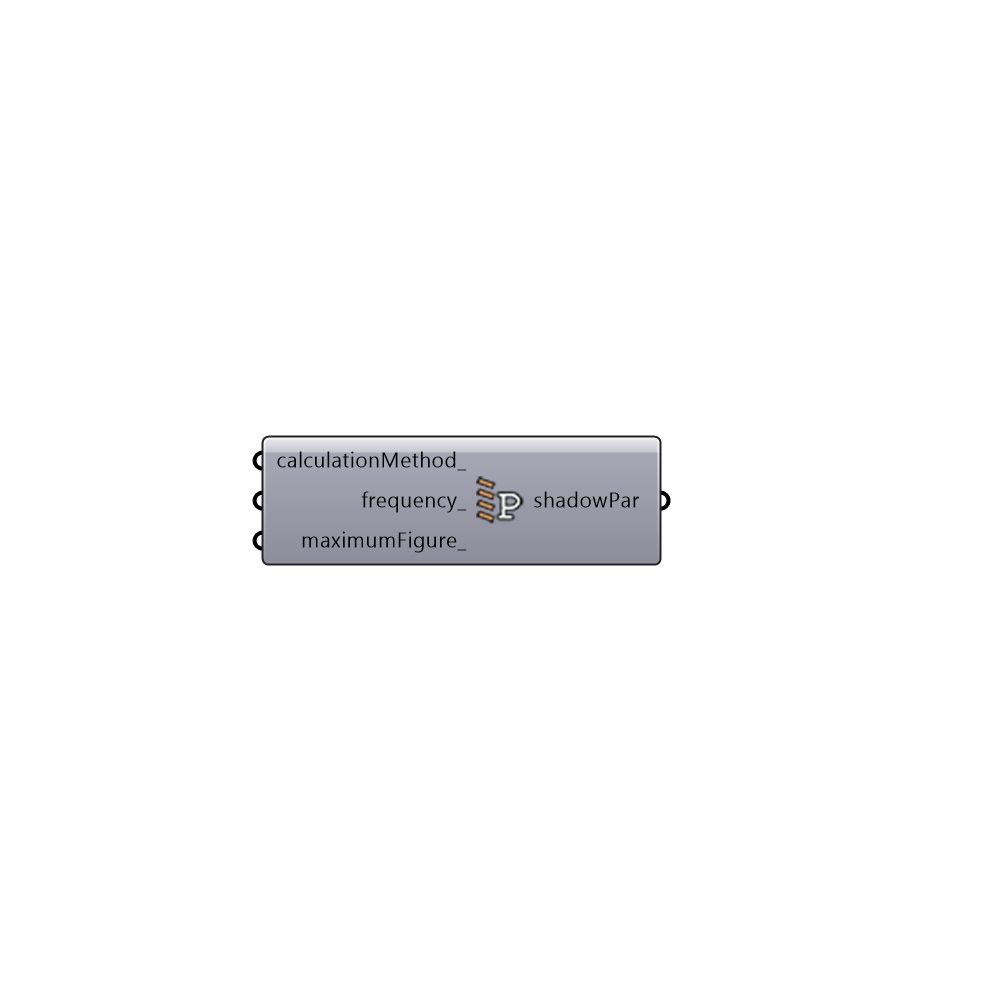

##  ShadowPar

EnergyPlus Shadow Parameters
 -
 

#### Inputs
* ##### calculationMethod [Optional]
An optional text string to set the means by which the shadow calculation is run.  Choose from the following two options:
 1 - AverageOverDaysInFrequency - A shadow calculation that averages over multiple days (as opposed to running it for each timeStep).  This is the default setting.
 2 - TimestepFrequency - A shadow calculation that computes the incoming solar energy at every single timestep of the simulation.  Note that this option is only needed for certain cases and can increase execution time significantly.
* ##### frequency [Optional]
An optional number that represents the frequency in days with which shadows are re-computed in the AverageOverDaysInFrequency calculation method.  The default is set to 30 days (meaning that the shadow calulation is performed every 30 days and this average over this period is used to represent all 30 days in the energy simulation).
* ##### maximumFigure [Optional]
An optional number that is greater than 200, which represents the maximum number of points to be used in the shadow calculation.  The default is set to 3000 points but this may need to be increased significantly if you have a lot of small context geometry in your model.

#### Outputs
* ##### shadowPar
Shadow calculation parameters that can be plugged into the "Honeybee_Energy Simulation Par" component.

[Check Hydra Example Files for ShadowPar](https://hydrashare.github.io/hydra/index.html?keywords=Honeybee_ShadowPar)