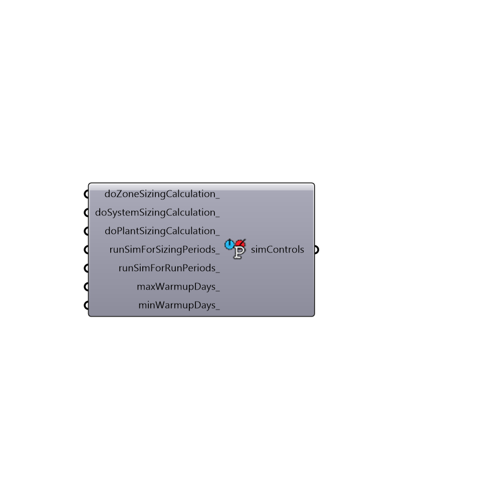

##  Simulation Control

Use this component to set EnergyPlus Simulation Controls such as whether to run certain types of HVAC sizing calculations, etc.
 -
 

#### Inputs
* ##### doZoneSizingCalculation [Optional]
Set to "True" to have EnergyPlus do a sizing calculation for the zones.  The default is set to "True."
* ##### doSystemSizingCalculation [Optional]
Set to "True" to have EnergyPlus do a sizing calculation for the HVAC system.  The default is set to "True."
* ##### doPlantSizingCalculation [Optional]
Set to "True" to have EnergyPlus do a sizing calculation for the HVAC plant (boiler and chiller).  The default is set to "True", although with ideal air loads, there is no plant as each zone has its own ideal air system and there is no central plant between zones.
* ##### runSimForSizingPeriods [Optional]
Set to "True" to have EnergyPlus run a simulation for the Sizing periods specified in the IDF.  The default is set to "False."  By default, the sizing periods are set to the extreme hot and extreme cold weeks of the weather file but a custom ddy file can also be specified with the "Honeybee_Energy Simulation Par" component.
* ##### runSimForRunPeriods [Optional]
Set to "True" to have EnergyPlus run the simulation for energy use over the entire year of the EPW.  The default is set to "True."
* ##### maxWarmupDays [Optional]
The minimum number of warmup days that you want the energyplus simulation to run before recording result values.  The default is set to 6.
* ##### minWarmupDays [Optional]
Script variable simControl

#### Outputs
* ##### simControls
A set of simulation controls tha can be plugged into the "Honeybee_Energy Simulation Par" component.

[Check Hydra Example Files for Simulation Control](https://hydrashare.github.io/hydra/index.html?keywords=Honeybee_Simulation Control)