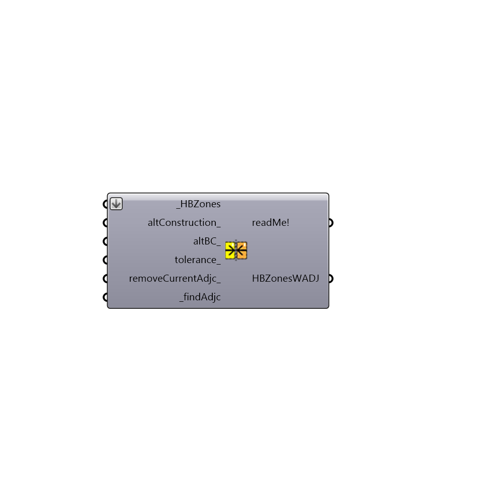

##  Solve Adjacencies - [[source code]](https://github.com/ladybug-tools/honeybee-legacy/tree/master/src/Honeybee_Solve%20Adjacencies.py)

Solve adjacencies
 -
 

#### Inputs
* ##### HBZones [Required]
A list of Honeybee zones for which you want to calculate whether they are next to each other.
* ##### altConstruction [Optional]
An optional alternate EP construction to assign to all adjacent surfaces.  The default is set to be "Interior Wall", "Interior Foor" or "Interior Ceiling" or "Interior Window" depending on the type of surface that is adjacent.
* ##### altWindowConstr [Optional]
An optional alternate EP window construction to assign to all adjacent surfaces.  The default is set to be the "Interior Window" construction with a single pane of clear glass.
* ##### altBC [Optional]
An optional alternate boundary condition such as "Adiabatic".  The default will be "Surafce", which ensures that heat flows across each adjacent surface to a neighboring zone.
* ##### tolerance [Optional]
The tolerance in Rhino model units that will be used determine whether two zones are adjacent to each other.  If no value is input here, the component will use the tolerance of the Rhino model document.
* ##### removeCurrentAdjc [Optional]
If you are using this component after already solving for the adjacencies between some of the zones previously, set this to "False" in order to remeber the previously determined adcacency conditions.  If set to "True", the current adjacencies will be removed. The default is set to "False" in order to remeber your previously-set adjacencies.
* ##### preserveConstr [Optional]
Set to "True" to preserve the existing constructions assigned to the interior surfaces of adjacent zones.  It is not recommedned that is input be used unless you are building zones surface-by-surface and have done a diligent job of making sure that construction materials are assigned in reverse order on adjacent surfaces.
* ##### findAdjc [Required]
Set to "True" to solve adjacencies between zones.

#### Outputs
* ##### readMe!
A report of the found adjacencies.
* ##### HBZonesWADJ
A list of Honeybee zones with adjacencies solved.

[Check Hydra Example Files for Solve Adjacencies](https://hydrashare.github.io/hydra/index.html?keywords=Honeybee_Solve Adjacencies)